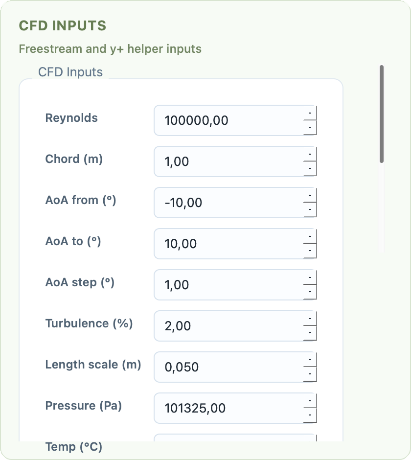

.. _CFD_bnd:

CFD Inputs and Boundary Conditions
==================================

The :guilabel:`CFD Inputs` page is a practical helper for preparing solver-side freestream and near-wall inputs. It does not write solver configuration files directly, but it calculates the values you typically need when setting up a case.

   CFD Inputs page with freestream, turbulence, and wall-distance helpers.

Inputs
======

The page takes:

- Reynolds number
- chord length
- angle-of-attack range and step
- turbulence intensity
- turbulence length scale
- static pressure
- temperature
- target flat-plate ``y+``

Calculated Outputs
==================

From these inputs, PyAero derives:

- density
- dynamic viscosity
- kinematic viscosity
- freestream velocity
- ``u`` and ``v`` velocity components over the selected angle-of-attack range
- target first-cell wall distance for the selected ``y+``
- turbulence kinetic energy

This is especially useful when you are trying to align the near-wall mesh size with a target solver setup.

Copy Workflow
=============

The results are shown in a text panel and can be copied to the clipboard. This makes the page convenient as a solver-prep scratchpad even though PyAero itself is not the CFD solver.

Typical Use
===========

Use this page when:

- you want a rough first-cell estimate before meshing
- you want to translate a Reynolds target into a physical freestream velocity
- you need quick ``u`` and ``v`` components for a sweep of angles of attack
- you want a convenient copyable summary for a solver case setup
