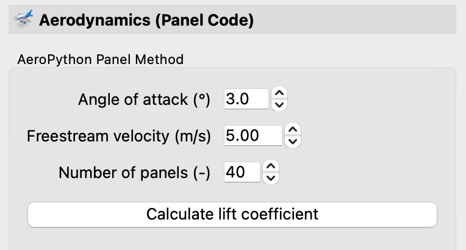

.. make a label for this file
.. _aero_panel:

Aerodynamics (panel code)
=========================

For fast lift coefficient calculations a panel method has been implemented. The code is based on an open source code developed by the `Barba group <https://lorenabarba.com/>`_. The codes in `Aeropython <https://github.com/barbagroup/AeroPython>`_ are part of a series of lessons of a university course. The specific module used here is based on a vortex-source panel method (code in `module 4 <https://nbviewer.org/github/barbagroup/AeroPython/blob/master/lessons/11_Lesson11_vortexSourcePanelMethod.ipynb>`_).

.. _figure_aeropython:

   Settings for the panel method.

Clicking on :guilabel:`Calulate lift coefficient` will calculate the lift coefficient for the current configuration. The code runs very fast and is not influenced much by the number of panels. The code is using its own paneling method. Paneling is either based on the airfoil raw data or on the splined contour data (if available). A too high number of panels may lead to convergence issues.

A typical result/output of the method is shown below (the information is displayed in the message window):

:code:`INFO - Aerodynamic properties of Makarov KPS Long Root:`
:code:`INFO - Cl =  1.268 [-] at Uinf =  5.000 [m/s], and AOA =  3.000 [degree]`

:title-reference:`Barba, Lorena A., and Mesnard, Olivier (2019). Aero Python: classical aerodynamics of potential flow using Python. Journal of Open Source Education, 2(15), 45, https://doi.org/10.21105/jose.00045`
