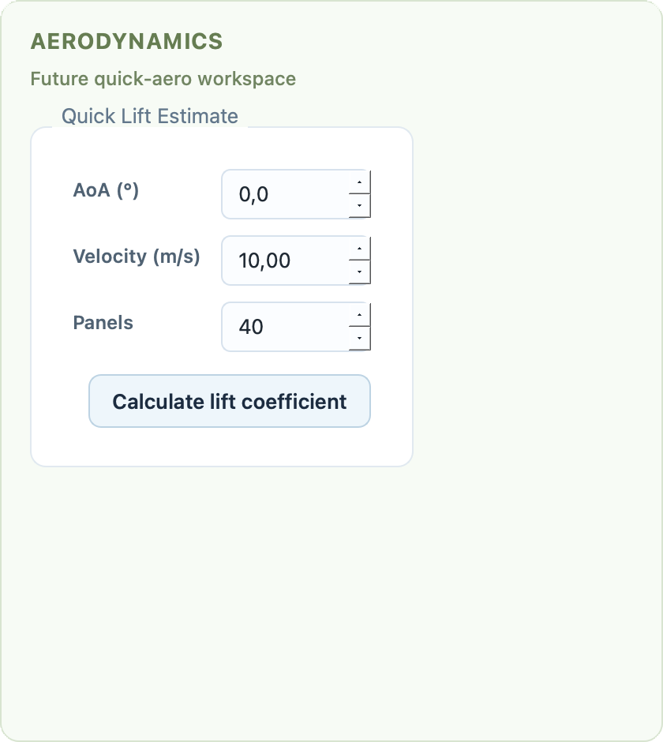

Aerodynamics Panel
==================

PyAero includes an :guilabel:`Aerodynamics` page in the workflow sidebar with inputs for:

- angle of attack
- freestream velocity
- panel count

The page is intended as a home for a quick panel-method style estimate workflow.

   Aerodynamics page in the workflow sidebar.

Current Status
==============

At the moment this page should be treated as experimental UI scaffolding rather than a fully documented production feature. The surrounding interface is in place, but the main PyAero documentation continues to focus on the mature geometry-preparation, meshing, export, and CFD-helper workflows.

In practice, most users will spend their time in:

- :ref:`loading_airfoils`
- :ref:`spline_refine`
- :ref:`meshing`
- :ref:`CFD_bnd`
