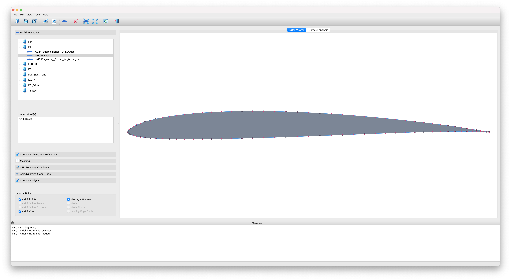

.. |br| raw:: html

    

.. important::
   The documentation is not yet finished, but should be good enough to make meshes.

********************
PyAero documentation
********************

PyAero is an airfoil contour analysis and CFD meshing tool written in Python. |br| 
PyAero is open-source and distributed under the MIT license, see `LICENSE <license.html>`_. |br|

.. figure::  images/SD7003_velocity_AOA6.png
   :align:   center
   :target:  _images/SD7003_velocity_AOA6.png
   :name: GUI

   PyAero generated mesh (Solver: `SU2 <https://su2code.github.io/>`_, Visualization: `ParaView <https://www.paraview.org/>`_)

   PyAero user interface at a glance

.. figure::  images/LE_mesh.png
   :align:   center
   :target:  _images/LE_mesh.png
   :name: Mesh_HN1033_LE

   Example mesh around HN1033 airfoil - Leading Edge

.. figure::  images/TE_mesh.png
   :align:   center
   :target:  _images/TE_mesh.png
   :name: Mesh_HN1033_TE

   Example mesh around HN1033 airfoil - Trailing Edge (with finite thickness)

.. figure::  images/mesh2.png
   :align:   center
   :target:  _images/mesh2.png
   :name: Mesh_HN1033

   Example mesh around HN1033 airfoil

.. figure::  movies/RG14_3D_laminar_Iso-Q_pressure.gif
   :align:   center
   :target:  _movies/RG14_3D_laminar_Iso-Q_pressure.gif
   :name: RG14_3D_laminar_Iso-Q_pressure

   Example calculation result

Above analysis result was obtained using the CFD code AVL-FIRE. It is an unsteady laminar 3D calculation of 
the RG14 airfoil. The mesh was thickened with several layers in spanwise direction in order to allow for 
turbulent fluctuations in all three dimensions. The calculation resulst shown is based on pure laminar 
settings (i.e. no turbulence model switched on). Later (result not shown) a LES calculation using the 
Kobayashi SGS model was done. With the used mesh resolution both approaches lead to quite similar results.

.. csv-table:: Aerodynamic coefficients, RG14 airfoil, RE=330000, AOA 2°, 20 million cells
   :header-rows: 1
   :widths: 14, 12, 12
   :align: center

   "Model", "Drag", "Lift"
   "Laminar", 0.0079, 0.371
   "LES", 0.0078, 0.362 

Features
========

 - Load and display airfoil contour files
 - Airfoil splining and refining
 
   - Prepare contour for meshing
   - Splining is done to get a smooth contour and sufficient contour points
   - Refining allows to improve leading and trailing edge resolution
 
 - Airfoil contour analysis
 
   - Analyze gradient, curvature, and curvature circle at the leading edge, i.e. leadinge edge radius
 
 - Trailing edge generation
 
   - Specification of the trailing edge thickness (blunt trailing edge)
   - Smart blending functions (arbitrary polynomial)
   - Independent blending for upper and lower contour (e.g. for strong cambered airfoils)
 
 - Automatic generation of block-strcuctured meshes for airfoils
 
   - Currently only single element C-type meshes are supported
 
 - Mesh control
 
   - Boundary layer region
   - Wake region
   - Windtunnel
 
 - Mesh export (most formats based on the `meshio <https://github.com/nschloe/meshio>`_ library)
 
   - `AVL FIRE <https://www.avl.com/fire>`_ (*.flma)
   - `SU2 <https://su2code.github.io/>`_ (*.su2)
   - `GMSH <http://gmsh.info>`_ (*.msh)
   - `VTK <https://vtk.org>`_ (.vtk)
   - `CGNS <https://cgns.github.io>`_ (.cgns)
   - `ABAQUS <https://www.3ds.com>`_ (.inp)

 
 - Simple aerodynamic analysis, i.e. panel methods
 
   - `AeroPython <http://nbviewer.ipython.org/github/barbagroup/AeroPython/blob/master/lessons/11_Lesson11_vortexSourcePanelMethod.ipynb>`_

Quick start guide
=================

Follow the :ref:`quickstart` tutorial to get a first impression of the key functionality.

Code repository
===============

The code ist hosted on GitHub: `PyAero source code <https://github.com/chiefenne/PyAero>`_

.. toctree::
   :hidden:

   Home <self>

.. toctree::
   :caption: Table of Contents
   :numbered:
   :maxdepth: 2
   :hidden:

   introduction
   quickstart
   ui_GUI
   load
   spline_refine
   trailing_edge
   meshing
   contour_analysis
   settings
   GUI_modification
   dependencies
   license
