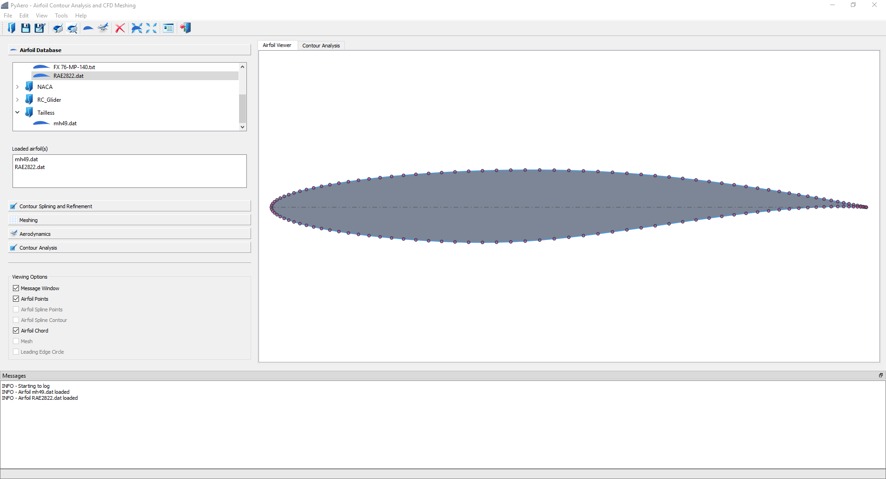
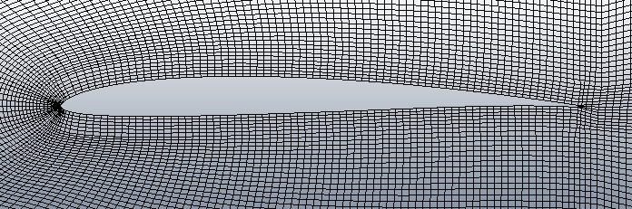
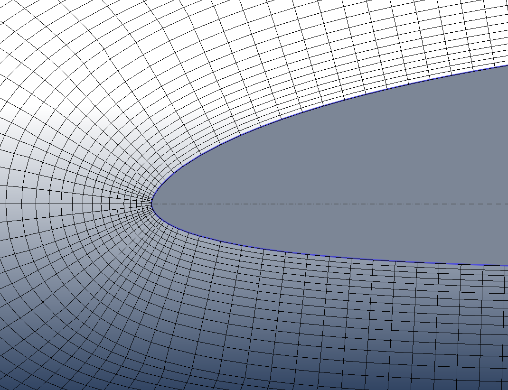
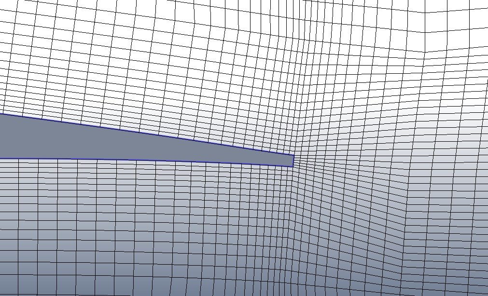
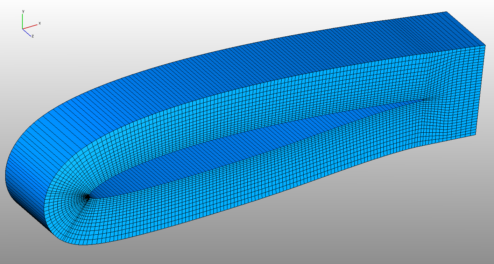

.. |br| raw:: html

    

.. important::
   This is the new version of PyAero. It is based on Python 3 and Qt for Python (PySide2).

.. note::
   The documentation is neither finished nor up to date.

********************
PyAero documentation
********************

PyAero is an airfoil contour analysis and CFD meshing tool written in Python. |br| 
PyAero is open-source and distributed under the MIT license, see `LICENSE <license.html>`_. |br|

   PyAero user interface at a glance

   Example mesh around HN1033 airfoil

   Example mesh around HN1033 airfoil - Leading Edge

   Example mesh around HN1033 airfoil - Trailing Edge (with finite thickness)

   Example mesh around RG15 airfoil as imported in AVL-FIRE (3rd mesh dimension 1 layer)

Features
========

 - Load and display airfoil contour files
 - Airfoil splining and refining
 
   - Prepare contour for meshing
   - Splining is done to get a smooth contour and sufficient contour points
   - Refining allows to improve leading and trailing edge resolution
 
 - Airfoil contour analysis
 
   - Analyze gradient, curvature, and curvature circle at the leading edge, i.e. leadinge edge radius
 
 - Trailing edge generation
 
   - Specification of the trailing edge thickness (blunt trailing edge)
   - Smart blending functions (arbitrary polynomial)
   - Independent blending for upper and lower contour (e.g. for strong cambered airfoils)
 
 - Automatic generation of block-strcuctured meshes for airfoils
 
   - Currently only single element C-type meshes are supported
 
 - Mesh control
 
   - Boundary layer region
   - Wake region
   - Windtunnel
 
 - Mesh export
 
   - `AVL FIRE <http://www.avl.com/fire-m>`_ (*.flma)
   - `SU2 <http://su2.stanford.edu/>`_ (*.su2)
   - `GMSH <http://gmsh.info>`_ (*.msh)
 
 - Simple aerodynamic analysis, i.e. panel methods
 
   - `AeroPython <http://nbviewer.ipython.org/github/barbagroup/AeroPython/blob/master/lessons/11_Lesson11_vortexSourcePanelMethod.ipynb>`_

Quickstart
==========

Follow the :ref:`quickstart` tutorial to get a first impression of the key functionality.

Or check this `PyAero tutorial on YouTube <https://www.youtube.com/watch?v=RBrBEyHAAss>`_ to get the minimum necessary introduction to `PyAero <index.html>`_.

Code repository
===============

The code ist hosted on GitHub: `PyAero source code <https://github.com/chiefenne/PyAero-Qt-for-Python>`_

.. toctree::
   :hidden:

   Home <self>

.. toctree::
   :caption: Table of Contents
   :numbered:
   :maxdepth: 3
   :hidden:

   introduction
   ui_GUI
   tutorial
   dependencies
   license
