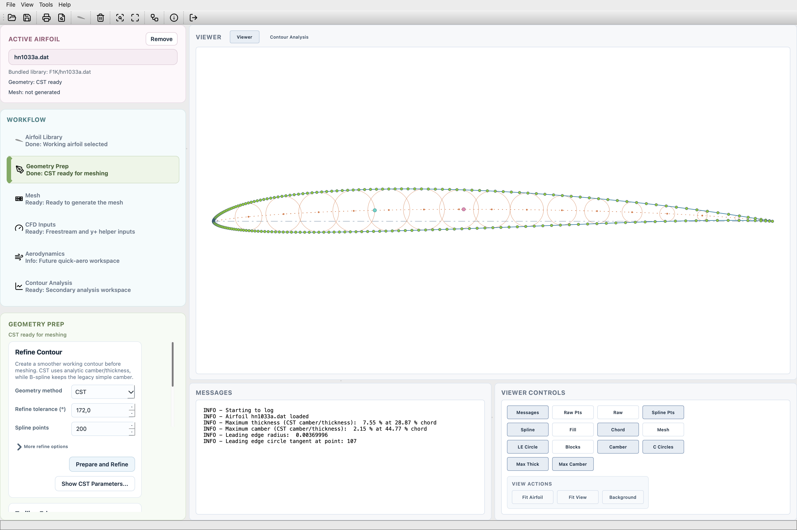

********************
PyAero Documentation
********************

PyAero is a desktop tool for airfoil contour preparation, contour analysis, and 2D block-structured CFD meshing. The project focuses on the work that happens before the solver: turning raw airfoil coordinates into a clean working contour, refining point placement where it matters, generating a structured wind-tunnel mesh, and exporting the result in practical formats.

The application is written in Python, uses `Qt for Python <https://www.qt.io/qt-for-python>`_ for the interface, and is distributed under the MIT license.

.. figure:: images/SD7003_velocity_AOA6.png
   :align: center
   :target: _images/SD7003_velocity_AOA6.png

   Example PyAero-generated mesh used in a downstream SU2 and ParaView workflow.

   The current workflow-oriented PyAero interface with sidebar, viewer, and utility panels.

What PyAero Covers
==================

- Load airfoils from the bundled library, a local library, or external contour files
- Prepare contours with CST or legacy B-spline workflows
- Refine leading-edge and trailing-edge point distributions
- Create finite-thickness trailing edges with independent upper and lower blending
- Inspect contour gradient, curvature, and radius plots
- Generate a structured C-type wind-tunnel mesh around the airfoil
- Smooth the mesh with simple, elliptic, or angle-based strategies
- Export meshes to ``.flma``, ``.su2``, ``.msh``, and ``.vtu``
- Export derived contour, camber, and CST data
- Prepare CFD helper inputs such as freestream components, wall distance, and turbulence values
- Run the same mesh-generation pipeline in batch mode

Recommended Reading Order
=========================

If you are new to the project, this is the fastest path through the manual:

1. :ref:`quickstart`
2. :ref:`user_interface`
3. :ref:`loading_airfoils`
4. :ref:`spline_refine`
5. :ref:`trailing_edge`
6. :ref:`meshing`

Notes
=====

- PyAero currently focuses on 2D structured mesh generation and export.
- The export path is actively maintained; mesh import exists as future-facing scaffolding rather than a full workflow.
- The application should be started from the repository root so bundled resources resolve correctly.

.. toctree::
   :caption: Table of Contents
   :numbered:
   :maxdepth: 2
   :hidden:

   introduction
   quickstart
   ui_GUI
   load
   spline_refine
   trailing_edge
   meshing
   contour_analysis
   CFD_boundary_conditions
   aerodynamics_panel
   batchmode
   settings
   GUI_modification
   dependencies
   license
