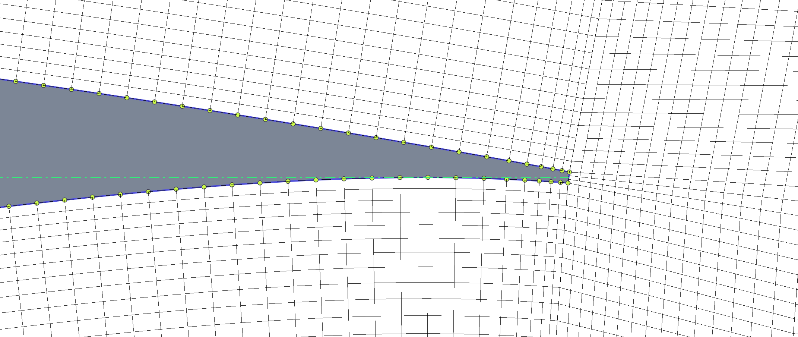

Introduction
============

PyAero is built around a simple idea: solver-ready meshes depend on solver-ready geometry. Many airfoil files in everyday use still come from sparse legacy point sets, and using them directly for structured meshing usually produces poor point placement around the leading edge, the trailing edge, or both. PyAero addresses that preparation step before the CFD workflow begins.

The application combines three areas of work in one desktop tool:

- airfoil loading and library management
- geometry preparation and contour analysis
- structured mesh generation and export

Project Focus
=============

PyAero currently focuses on 2D airfoil workflows. The application does not perform the CFD solve itself. Instead, it prepares contour and mesh data for downstream tools such as SU2, Gmsh, ParaView, and AVL FIRE-based workflows.

The strongest current path is:

1. load a raw airfoil contour
2. prepare a refined working contour
3. optionally add a finite-thickness trailing edge
4. generate the tunnel mesh
5. export one or more mesh files

Geometry Preparation
====================

PyAero provides both CST and legacy B-spline based geometry preparation. In both cases, the goal is the same: create a smooth contour with a point distribution that works well for the structured boundary-layer block built around the airfoil.

The preparation step includes:

- smoothing the raw contour representation
- controlling the number of spline sample points
- recursively refining the leading edge
- explicitly refining the trailing-edge segments
- deriving contour-analysis data such as curvature and leading-edge radius

Optional Trailing Edge Thickening
=================================

Real airfoils often need a finite trailing-edge thickness for manufacturing or structural reasons. PyAero can add a blunt trailing edge and blend it back into the prepared contour with separate upper and lower controls. This is especially useful when the mesh needs a physically meaningful trailing-edge gap instead of a sharp closure.

Mesh Generation
===============

The mesh generator creates a block-structured C-type wind-tunnel mesh. The workflow is organized around four logical regions:

- the near-airfoil block
- the trailing-edge block
- the outer tunnel block
- the wake block

This makes it possible to control the near-wall spacing, trailing-edge resolution, farfield height, and wake stretching separately.

.. figure:: images/mesh_RAE2822_MAC.png
   :align: center
   :target: _images/mesh_RAE2822_MAC.png

   Example structured mesh around the RAE2822 airfoil.

.. figure:: images/LE_mesh_RAE2822_MAC.png
   :align: center
   :target: _images/LE_mesh_RAE2822_MAC.png

   Leading-edge close-up of the structured mesh.

   Trailing-edge close-up for a finite-thickness trailing edge.

Exports and Downstream Use
==========================

PyAero exports meshes to:

- ``FLMA`` for AVL FIRE workflows
- ``SU2``
- ``Gmsh`` ``.msh``
- ``VTU``

The export layer also carries boundary naming so the generated files can be used more directly in solver or post-processing setups.
