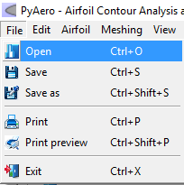
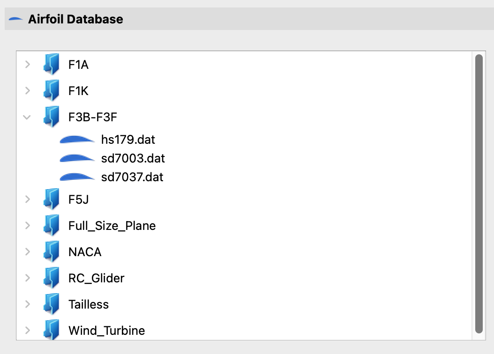
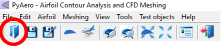
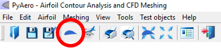
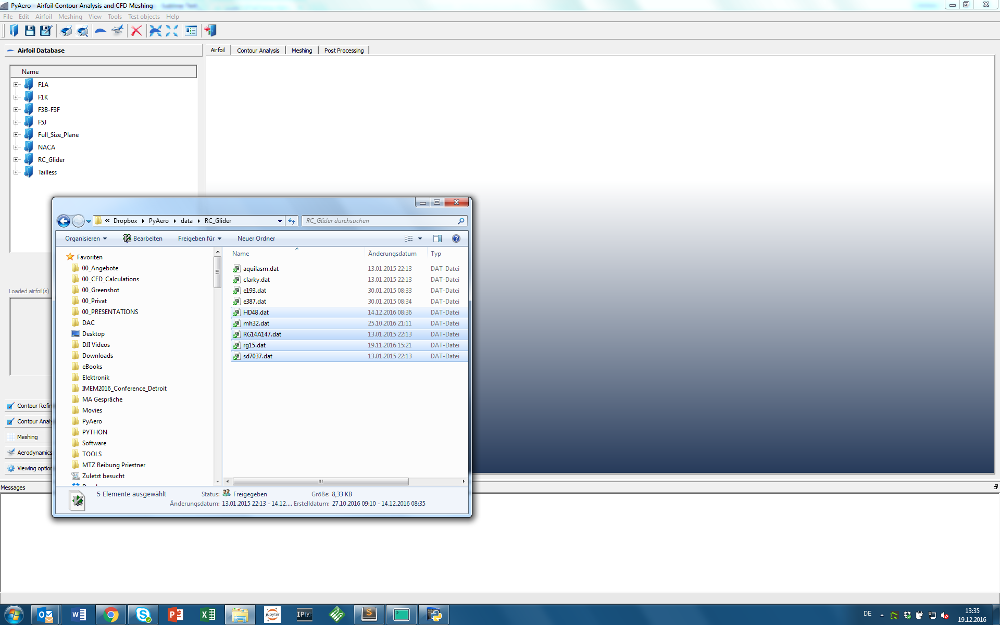
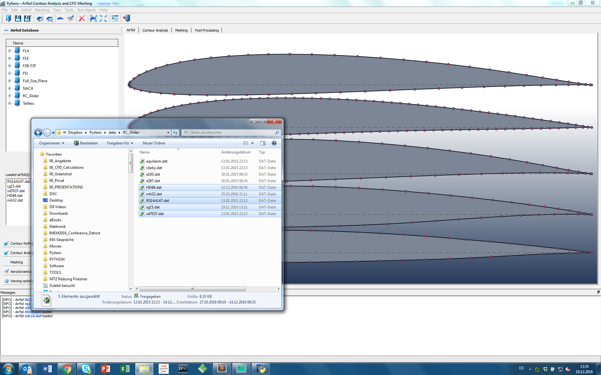

.. make a label for this file
.. _loading_airfoils:

.. |right_Arrow| unicode:: U+025BA .. BLACK RIGHT-POINTING POINTER
.. |right_medium_Arrow| unicode:: U+023F5 .. BLACK MEDIUM RIGHT-POINTING TRIANGLE
.. |down_right_Arrow| unicode:: U+021B3 .. DOWNWARDS ARROW WITH TIP RIGHTWARDS

Loading Airfoils
================

Loading airfoils can be done in different ways:

Load via menu :menuselection:`File --> Open`
--------------------------------------------

The :guilabel:`File` |right_medium_Arrow| :guilabel:`Open` menu is the standard way to load airfoil contour data. The shortcut assigned to this menu is :kbd:`CTRL-o`. Clicking :guilabel:`Open` or applying the respective shortcut provides a dialog that allow users to select files or browse directories.

.. note:: The keyboard shortcuts are rendered as uppercase letters in the GUI (see following figure). Nevertheless, always lowercase letters need to be pressed.

.. _figure_menu_open:

   *Open* menu to load an airfoil contour via the file browser

Load via the inline file browser
--------------------------------

As outlined above there are more ways to load airfoils. A very handy way to browse airfoils is to use the implemented file browser. This browser is restricted in terms of navigation. Only files and folders below a predefined root path are visible. The default root is  the :file:`data` subfolder from the standard installation.

The file browser is located in the *toolbox* area on the left side of the application (see also :ref:`figure_main_screen`). A *toolbox* is a GUI element that displays a column of tabs one above the other, with the current item displayed below the current tab.

.. _figure_toolbox_area:

   File browser integrated in the *Toolbox*.

.. seealso:: For more information on configuring the root path to airfoil data see :ref:`tutorial_settings`.

Load via the *Toolbar*
----------------------

Another fast way to open the file dialog is to click on the :menuselection:`Open` icon (see image below) in the toolbar. The toolbar consists of a row of icons just below the menu bar. The toolbar can be customized by editing the file :file:`$PYAEROPATH/data/PToolBar.xml`.

.. _figure_toolbar_open:

   Toolbar icon to load an airfoil contour via the file browser

.. seealso:: For more information on configuring the menubar and the toolbar see :ref:`tutorial_settings`.

Load a predefined airfoil
-------------------------

For testing purposes a predefined airfoil can be loaded without the need of a file dialog. The airfoil which is predefined can be configured.

.. _figure_toolbar_open_predefined:

   Toolbar icon to load a predefined airfoil contour

.. seealso:: See tutorial :ref:`tutorial_settings` on how to change the default airfoil.

Load via drag and drop
----------------------

another convenient way to load one or more airfoil(s) is via drag and drop. Just drag a couple of files, e.g. from the Explorer in Windows, to the graphics window. All files will be loaded and the view will be zoomed in way that all contours fit into the screen.

.. _figure_drag_and_drop:

.. _figure_drag_and_drop:

   Load multiple contours via drag and drop

