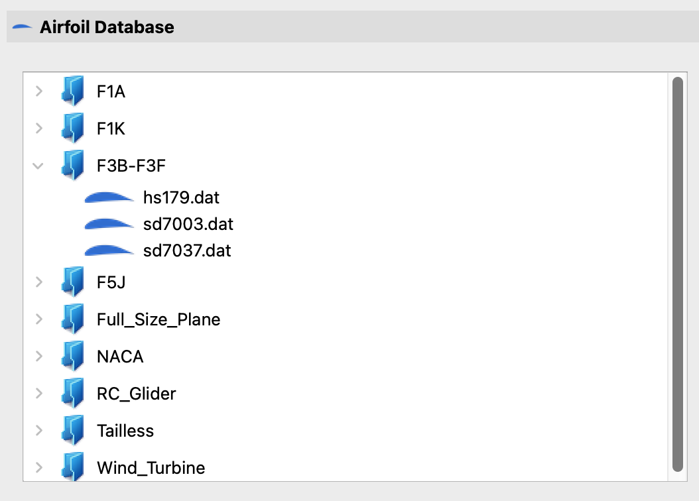
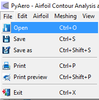
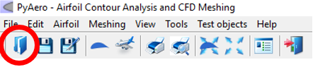
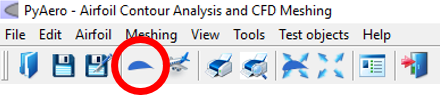

.. _loading_airfoils:

Loading Airfoils
================

PyAero now centers the loading workflow around the :guilabel:`Airfoil Library` page, while still supporting direct file loading and drag-and-drop for quick use.

Airfoil Library
===============

The library page is the main entry point for airfoil files. It provides:

- a searchable list of available airfoils
- source filters for :guilabel:`Bundled`, :guilabel:`Local`, and :guilabel:`All`
- a status area showing where the selected entry lives
- direct actions for opening an external file, importing a file into the local library, or loading the selected entry

Bundled entries come from the repository's configured airfoil root. Local entries live under the automatically managed local library folder inside that root.

   The library page in the workflow sidebar.

Supported File Types
====================

The main airfoil loading workflow accepts:

- ``.dat``
- ``.txt``

These are interpreted as airfoil contour files.

Open an External File
=====================

There are two straightforward ways to open a contour file from outside the library:

- :menuselection:`File --> Open`
- :guilabel:`Open File...` in the library page

   Opening an external contour file through the standard file dialog.

Import into the Local Library
=============================

If you want an external file to become part of your recurring working set, use :guilabel:`Add To Local...`. PyAero copies the selected contour into the managed local library folder and makes it available through the :guilabel:`Local` and :guilabel:`All` filters.

This is useful when:

- you frequently reuse a custom airfoil
- you want a small curated project-specific library
- you want to keep external downloads separate from the bundled sample collection

Toolbar Shortcuts
=================

The traditional toolbar entries are still available for quick access:

- open a contour file
- load the configured predefined airfoil

   Toolbar button for opening an external contour file.

   Toolbar button for loading the predefined airfoil.

Drag and Drop
=============

You can also drag one or more contour files directly into the graphics view. PyAero will register the dropped airfoils in the workspace and activate one of them immediately.

.. figure:: images/Drag_and_drop.gif
   :align: center
   :target: _images/Drag_and_drop.gif

   Loading airfoils by drag and drop.

Related Settings
================

The default airfoil root and the predefined airfoil are configurable. See :ref:`tutorial_settings` for the configuration file locations and shortcut settings.
