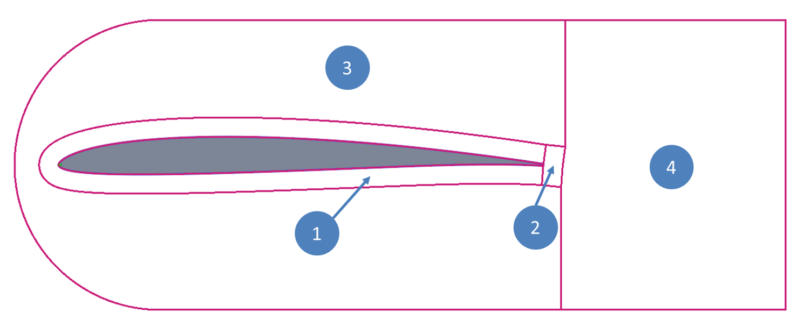
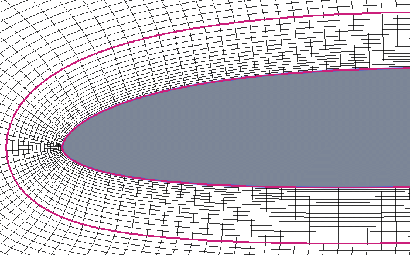
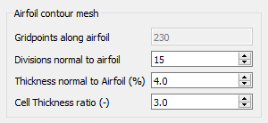

.. make a label for this file
.. _meshing:

Making Meshes
=============

After :ref:`spline_refine` and optionally making a blunt :ref:`trailing_edge`, the airfoil contour can be meshed which is the primary purpose of `PyAero <index.html>`_.

The default settings for the mesh generation process should be good enough to generate a mesh that can be used to do CFD RANS simulations.

The mesh is constructed from four individual blocks, each of which has its own configuration options.
The mesh blocks are (listed below with the same name as in the GUI):
  - Airfoil contour mesh (block 1)
  - Airfoil trailing edge mesh (block 2)
  - Windtunnel mesh around airfoil (block 3)
  - Windtunnel mesh in the wake (block 4)

.. _figure_mesh_blocks:

   Mesh blocking structure

The main mesh block is the one directly attached to the airfoil contour. It is constructed by grid lines emerging perpendicular from the airfoil, starting at the points from the splined contour (see :ref:`spline_refine`). Another set of lines parallel to the airfoil contour complete the main mesh block. The default settings there implement a streching away from the airfoil, so that the thinnest mesh layer is attached at the airfoil and further mesh layers are gradually thickened outwards.

.. _figure_mesh_block_1:

   Mesh around airfoil (block 1)

The process of constructing the grid lines perpendicular and parallel to the contour guarantees a fully orthogonal mesh in the vicinity of the airfoil which is important for keeping numerical errors as low as possible in the region of interest.

.. _mesh_settings_airfoil_contour:

   Settings for the mesh around the airfoil (block 1)
