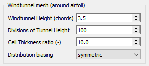
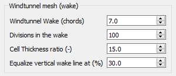

.. make a label for this file
.. _meshing:

Making Meshes
=============

After :ref:`spline_refine` and optionally making a blunt :ref:`trailing_edge`, the airfoil contour can be meshed which is the primary purpose of `PyAero <index.html>`_. As for splining and refining the meshing options are located in the toolbox area which is the left pane of the user interface (see :ref:`toolbox_functions`).

The default settings for the mesh generation process should be good enough to generate a mesh that can be used to do CFD RANS simulations.

The mesh is constructed from four individual blocks, each of which has its own configuration options.
The mesh blocks are (listed below with the same name as in the GUI):
  - Airfoil contour mesh (block 1)
  - Airfoil trailing edge mesh (block 2)
  - Windtunnel mesh around airfoil (block 3)
  - Windtunnel mesh in the wake (block 4)

.. _figure_mesh_blocks:
.. figure::  images/mesh_blocks.png
   :align:   center
   :target:  _images/mesh_blocks.png
   :name: MeshBlocks

   Mesh blocking structure

The main mesh block is the one directly attached to the airfoil contour. It is constructed by grid lines emerging perpendicular from the airfoil, starting at the points from the splined contour (see :ref:`spline_refine`). Another set of lines parallel to the airfoil contour complete the main mesh block. The default settings there implement a streching away from the airfoil, so that the thinnest mesh layer is attached at the airfoil and further mesh layers are gradually thickened outwards.

.. _figure_mesh_block_1:
.. figure::  images/mesh_block1bb.gif
   :align:   center
   :target:  _images/mesh_block1bb.gif
   :name: MeshBlock1

   Mesh around airfoil (block 1)

The process of constructing the grid lines perpendicular and parallel to the contour guarantees a fully orthogonal mesh in the vicinity of the airfoil which is important for keeping numerical errors as low as possible in the region of interest. The mesh distribution settings for this block are depicted in the following figure (:ref:`mesh_settings_airfoil_contour`).

.. _mesh_settings_airfoil_contour:
.. figure::  images/mesh_settings_airfoil_contour.png
   :align:   center
   :target:  _images/mesh_settings_airfoil_contour.png
   :name: SettingsAirfoilContour

   Settings for the mesh around the airfoil (block 1)

The value for the number of :guilabel:`Gridpoints along airfoil` contour is grayed out. This value is taken from the number of points on the spline (see :ref:`figure_toolbox_spline_refine_1`) and is displayed here just for reference. If a different number of grid points along the contour is required the spline has to be updated first. Next the :guilabel:`Divisions normal to airfoil` allows to vary the number mesh layers normal to the contour within mesh block 1. The setting :guilabel:`Thickness normal to airfoil (%)` specifies the dimension/length of block 1 normal to the contour in percentage of the airfoil chord. It is limited to 100% chord length, but typical values would be in the range 5% to 20%. The final parameter for block 1 is the :guilabel:`Cell thickness ratio (-)`. It specifies the ratio of the cell thickness of the outermost cell in the block (wrt to airfoil normal direction) over the cell thickness of the layer which is attached to the contour. So if for example the ratio is 3, the outer cell layer of block one is 3 times a thick as the cell layer at the airfoil.

.. _mesh_settings_TE:
.. figure::  images/mesh_settings_TE.png
   :align:   center
   :target:  _images/mesh_settings_TE.png
   :name: SettingsTrailingEdge

   Settings for the airfoil trailing edge mesh (block 2)

.. _mesh_settings_WT_airfoil:

   Settings for the windtunnel around the airfoil (block 3)

.. _mesh_settings_WT_wake:

   Settings for the windtunnel in the wake (block 4)

