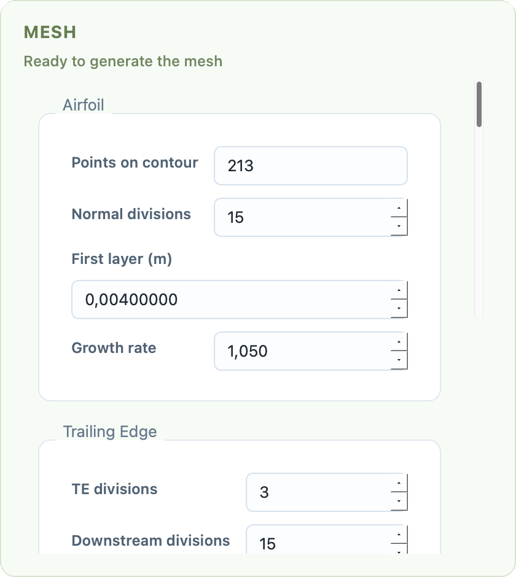
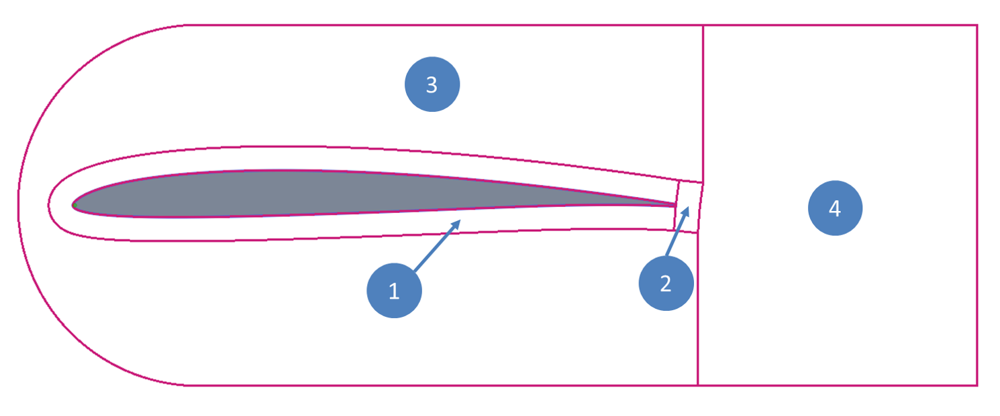
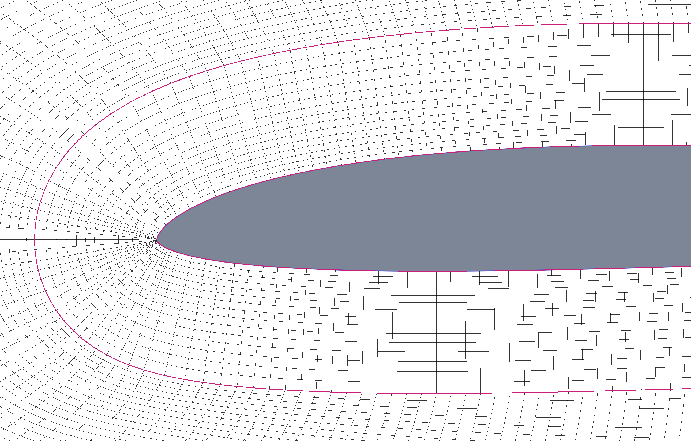
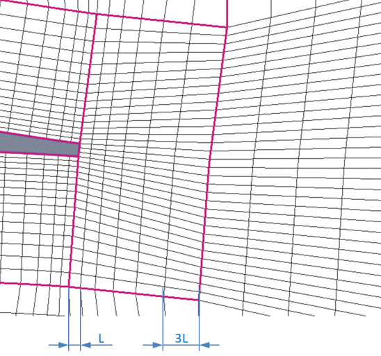
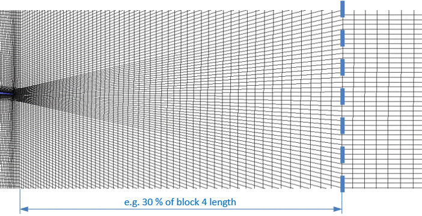
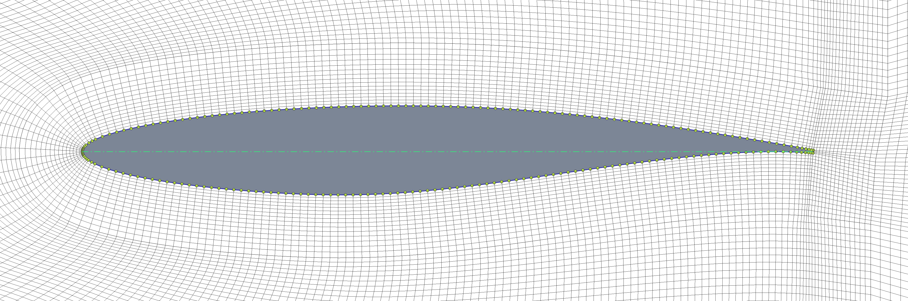
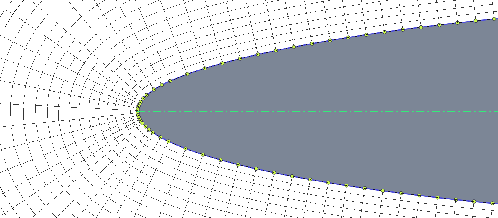
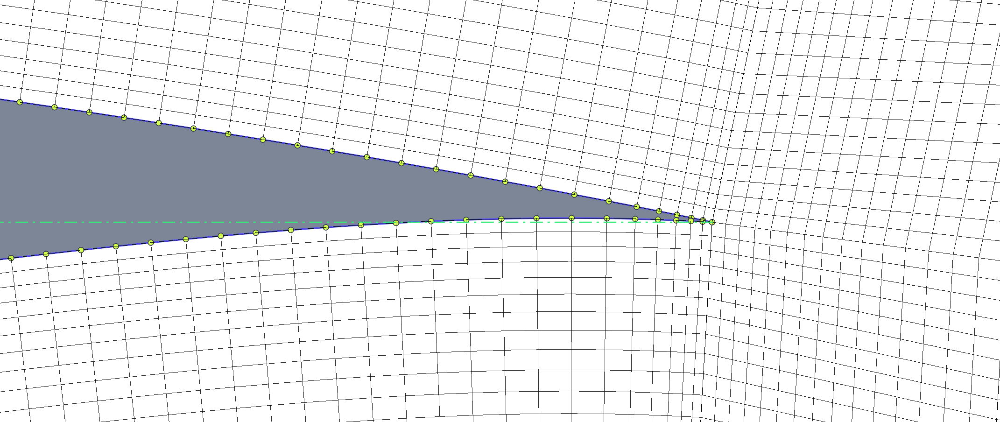

.. _meshing:

Making Meshes
=============

After preparing the contour and optionally adding a finite-thickness trailing edge, the :guilabel:`Mesh` page is where PyAero turns the working geometry into a structured wind-tunnel mesh.

   Mesh page with block settings, smoothing controls, and export options.

Mesh Layout
===========

PyAero builds the final mesh from four logical blocks:

- the near-airfoil block
- the trailing-edge block
- the outer tunnel block
- the wake block

This layout makes it possible to tune the boundary-layer region, the trailing edge, the farfield, and the wake independently.

   Block structure used by the structured tunnel mesh.

Airfoil Block
=============

The airfoil block is the most important part of the mesh. It starts from the prepared contour and grows outward along local normals.

Its main controls are:

- :guilabel:`Points on contour`
- :guilabel:`Normal divisions`
- :guilabel:`First layer (m)`
- :guilabel:`Growth rate`

The point count is inherited from the prepared contour and shown mainly for reference. If you need a different count along the airfoil, change the preparation step first.

   The structured near-airfoil block.

Trailing-Edge Block
===================

The trailing-edge block resolves the downstream region directly behind the airfoil. It is especially important when a finite-thickness trailing edge is present.

Its controls are:

- :guilabel:`TE divisions`
- :guilabel:`Downstream divisions`
- :guilabel:`First layer (m)`
- :guilabel:`Growth rate`

   The trailing-edge block and its local resolution.

Tunnel Block
============

The tunnel block wraps the airfoil block and extends the mesh to the farfield boundary. It controls the tunnel height and the vertical distribution in the outer domain.

Main controls:

- :guilabel:`Tunnel height (c)`
- :guilabel:`Height divisions`
- :guilabel:`Thickness ratio`
- :guilabel:`Bias`

For strongly cambered airfoils, adjusting the bias can improve the outer block quality.

Wake Block
==========

The wake block extends the tunnel downstream. It controls how far the domain continues beyond the trailing edge and how the downstream spacing evolves.

Main controls:

- :guilabel:`Wake length (c)`
- :guilabel:`Wake divisions`
- :guilabel:`Thickness ratio`
- :guilabel:`Wake equalize (%)`

   Wake equalization in the downstream block.

Smoothing
=========

The current interface exposes three smoothing modes:

- :guilabel:`Simple`
- :guilabel:`Elliptic`
- :guilabel:`Angle based`

The elliptic mode exposes the richest control set. In addition to iterations and tolerance, it includes advanced controls for:

- outer-boundary sliding
- elliptic relaxation
- protected guide relaxation
- protected guide layer count
- protected guide decay
- guide-profile smoothing

These controls are meant to preserve the interface between the near-airfoil region and the outer tunnel block while improving the quality of the outer mesh.

Mesh Export
===========

Once the mesh is generated, the export section lets you:

- define boundary names
- choose one or more output formats
- write the mesh files with one basename

Supported export formats are:

- ``FLMA``
- ``SU2``
- ``Gmsh`` ``.msh``
- ``VTU``

Boundary names are validated before export so blank or duplicate labels are rejected.

Generated files use a shared basename and the correct extension is appended automatically for each selected format.

Examples
========

   Example final mesh around RAE2822.

   Leading-edge close-up.

   Sharp trailing-edge variant.

.. figure:: images/complete_mesh.gif
   :align: center
   :target: _images/complete_mesh.gif

   Example full mesh creation result.

Practical Advice
================

- If the mesh looks wrong near the airfoil, revisit the contour preparation step first.
- If the trailing-edge region is too coarse, increase the trailing-edge divisions and downstream divisions.
- If the outer tunnel looks strained, try the elliptic smoother with conservative relaxation before making large geometry changes.
