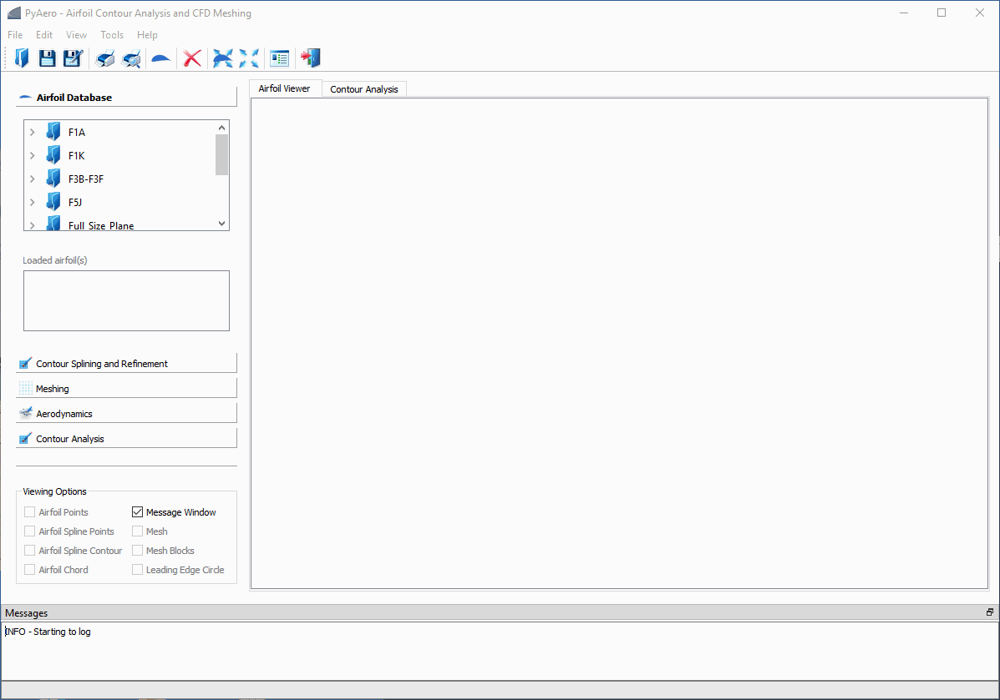

.. make a label for this file
.. _quickstart:

Quickstart
==========

The general steps for mesh generation in `PyAero <index.html>`_ can be explained as follows:

1. Load an airfoil contour file

   - Loading can be done in several ways (see also :ref:`loading_airfoils`).
   - For the quick start, just use the predefined airfoil by clicking the airfoil symbol in the toolbar 
     (between printer and delete symbols)

2. Spline and refine the airfoil contour

   - This is an important task, since the mesh around the airfoil is based on the point distribution 
     which is generated right here
   - To apply this feature, click inside the toolbox (left pane in the GUI) on the toolbox 
     :guilabel:`Contour Splining and Refinement`

   - For first tests you can go with the default settings and just click the button:
   
     :guilabel:`Spline and Refine` button inside this toolbox section

   - The contour will first be splined (constant distance between points) with the given number of points
   - In the same step the contour will be refined mainly around the leading edge. The refinment criterion 
     is a minimum angle between two consecutive line segments made of three adjacent points

3. Make a trailing edge with finite thickness

   - Since in real life the airfoil trailing edge has a finite thickness, this can to be taken into 
     account before meshing
   - To create a finite thickness trailing edge click inside the same toolbox section on:
   
     :guilabel:`Add Trailing Edge`

   - The default settings make a trailing edge with a thickness of 0.4% relative to the unity chord length
   - Omit this step if you want a sharp trailing edge mesh.

4. Mesh the refined airfoil contour

   - To apply this feature, click inside the toolbox (left pane in the GUI) on :guilabel:`Meshing`
   - To create the mesh scroll down inside this toolbox section and click on:
   
     :guilabel:`Create Mesh`

5. Export the mesh in the required format

   - Click on :guilabel:`Export Mesh` to export (i.e. save) the mesh in a specific format.
     Use the appropriate check box, e.g. SU2 for an *.su2 formatted file or GMSH for a *.msh formatted file.

This is it.

Check the animation below, on how this looks in the graphical user interface.

.. _figure_quickstart_steps:

   Step by step mesh generation with predefined airfoil contour
