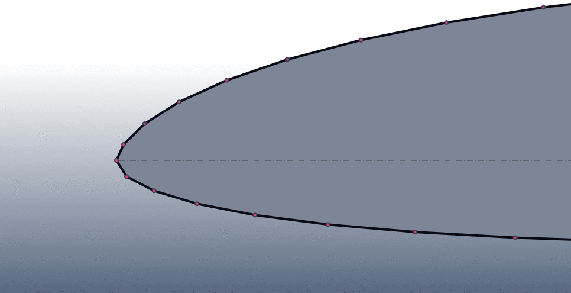
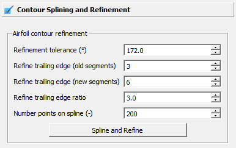
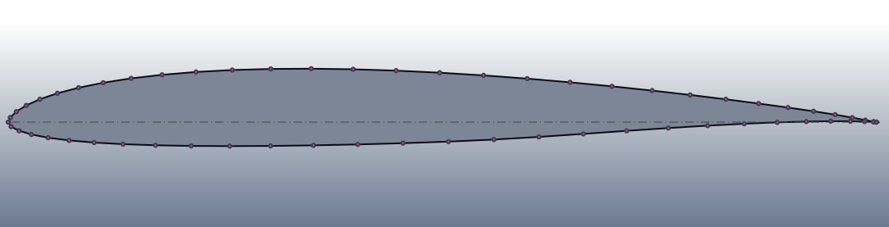
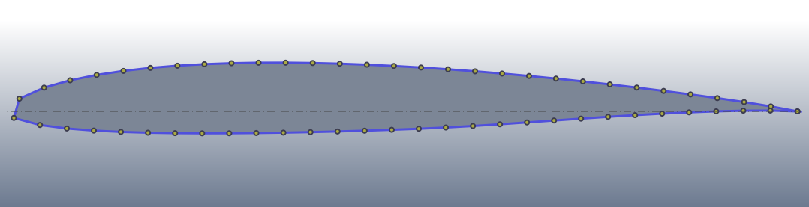
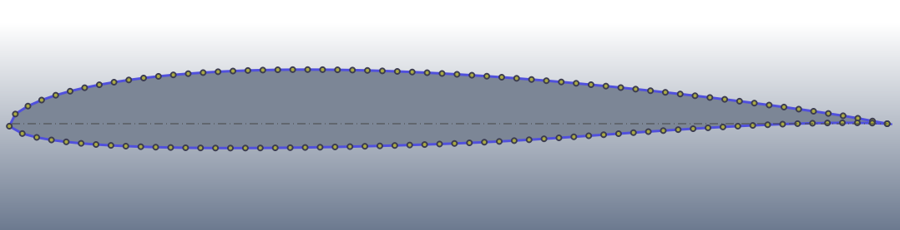
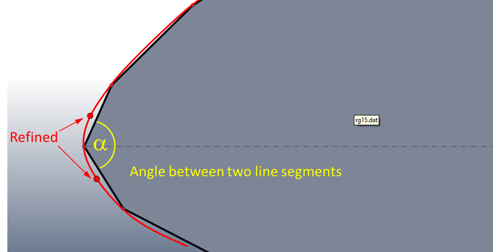
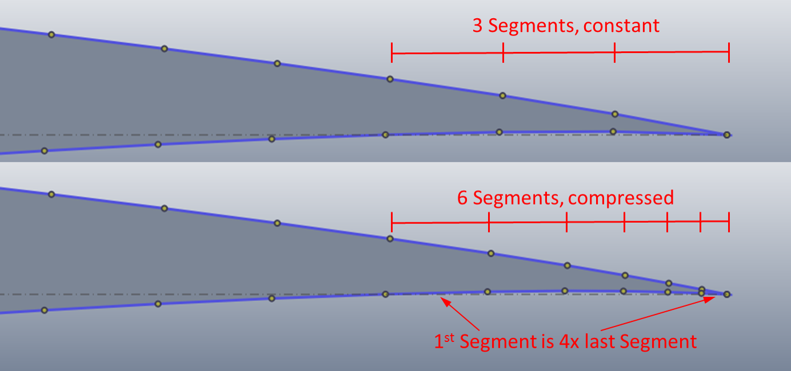

.. make a label for this file
.. _spline_refine:

Splining and Refining Airfoil Contours
======================================

The meshing process in `PyAero <index.html>`_ relies on the point distribution on the airfoil contour. During meshing, there is a mesh constructed around the airfoil, which consists of mesh lines perpendicular 
to the airfoil contour. The mesh lines are starting at the individual airfoil contour points. So in order to  be able to generate a proper mesh, the contour point distribution has to be adapted first. This is important, 
because particularly legacy wing sections have quite a coarse resolution (around 60 points). In the figure below, there is an animation of:

- the original airfoil contour
- the splined airfoil contour
- and the mesh lines parting from the splined contour

.. _figure_splining_animated_new:

   Airfoil contour before and after splining

Two functions improve the contour before meshing. After clicking *Spline and Refine* in the respective toolbox function, the contour will at first be splined and in a second step refined.

.. _figure_toolbox_spline_refine_1:

   Toolbox function for specifying spline and refining parameters

The splining is done using B-splines via the Scipy function :code:`scipy.interpolate.splprep`. This produces a spline representation through the initial (raw) airfoil contour. The number of points on the spline obviously can be set by `Number of points on spline`. Using an equal arc length the respective number of points is distributed homogeneously along the spline. This is the intended behaviour, as it guarantees constant size mesh cells around the airfoil (since the mesh is based on these points). 

.. _figure_splining_raw:

   Airfoil RG15: Points are as loaded from original file

.. _figure_splining_60pts:

   Airfoil RG15: Contour after splining with 60 points, no refinements

.. _figure_splining_120pts:

   Airfoil RG15: Contour after splining with 120 points, no refinements

Obviously, at the leading and trailing edges some more care is necessary to produce the required mesh resolution. At the leading edge it is required to resolve the big pressure gradients which are produced by the shape of the airfoil nose.

A recursive refinement algorithm is used to resolve the contour until a certain criterion is met (see following figure). A B-spline is interpolated throug the given raw contour points. At first, equidistant arc length segments are created on the spline (according to the prescribed number of points). During recursive refinement, the algorithm checks each pair of adjacent line segments if they match the criterion. The criterion is based on the angle included between adjacent segments. If the angle is less than a threshold specified by the user via the `Refinement tolerance` input, the algorithm adds two points. Each point is placed on the interpolated spline, half distance within each of the current segments. Then, new segments are created and angles are checked over and over again, until no pair of segments exists which include angles less than the threshold. This guarantees that the angle between adjacent mesh cells in the boundary layer is as uniform as possible. Thus, pressure gradients around the airfoil are resolved with the same quality.

.. _figure_refining_1:

   Refinement algorithm

Angles between 170° and 173° already produce very well resolved leading edge contours (see following figures).

.. _figure_splining_60pts_ref170:
.. figure::  images/splining_60pts_ref170.png
   :align:   center
   :target:  _images/splining_60pts_ref170.png
   :name: splining_60pts_ref170

   Airfoil RG15: Contour after splining with 60 points, LE refinement 170°

.. _figure_splining_60pts_ref170_close:
.. figure::  images/splining_60pts_ref170_close-up.png
   :align:   center
   :target:  _images/splining_60pts_ref170_close-up.png
   :name: splining_60pts_ref170_close

   Airfoil RG15: Close-up, 60 points, LE refinement 170°

At the trailing edge again pronounced pressure gradients due to flow separation shall be resolved by a finer mesh.

.. _figure_splining_60pts_ref170_TE3:

   Airfoil RG15: Contour after splining with 60 points, LE and TE refinements

The trailing edge refinement algorithm is somewhat simpler. The user specifies the number of segments to be refinded at the trailing edge. If the number of `Refine trailinge edge (old segments)` is 3, both, at the upper and lower sides of the contour, the last 3 segments are selected for refinement. The number of segments is then changed to `Refine trailinge edge (new segments)`. If this number is 6 and the chosen compression rate `Refine trailinge edge ratio` is 4, a distribution as depicted in figure :ref:`figure_refining_3` is created.

.. _figure_refining_3:

   Airfoil RG15: Close-up, 60 points, LE refinement 3, 6, 4

