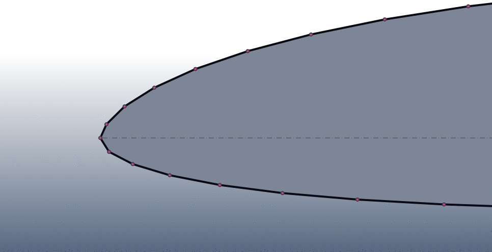
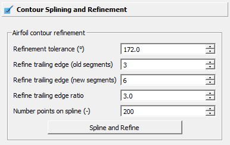
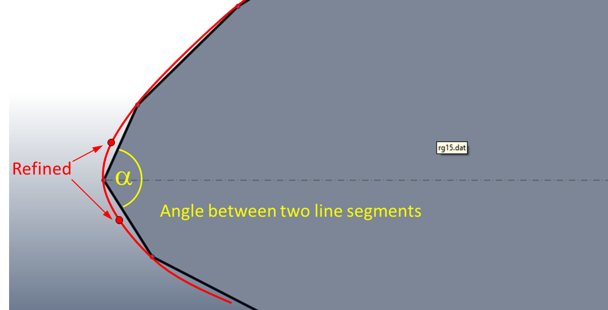
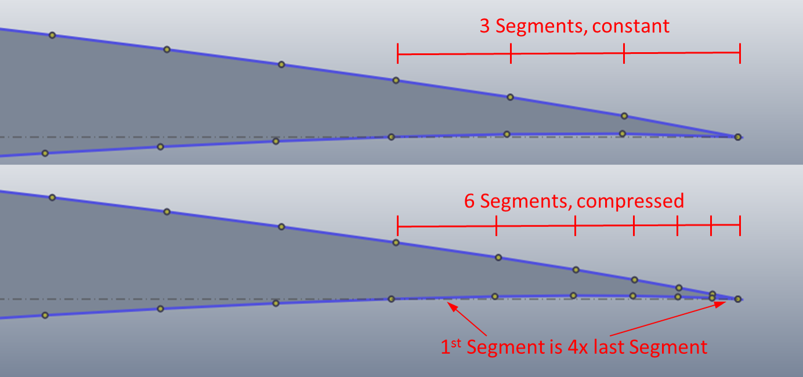
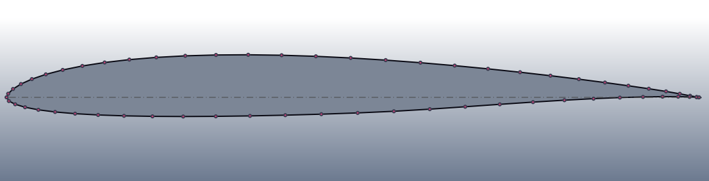
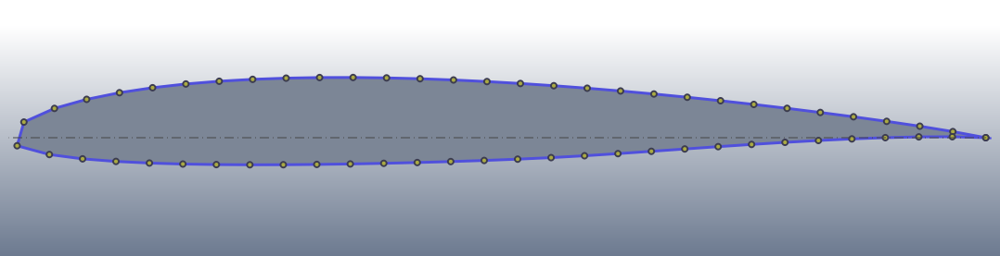
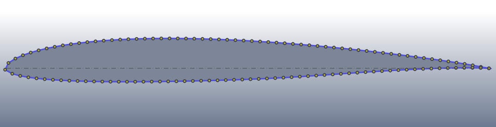
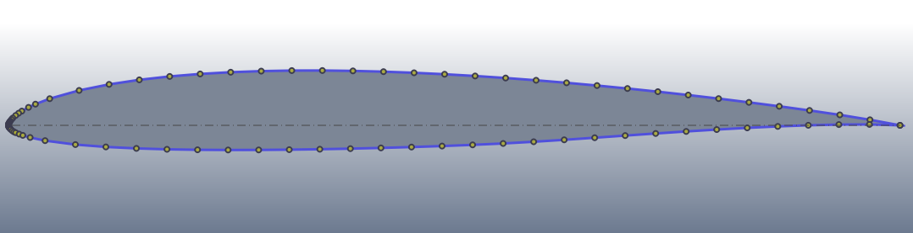

.. _spline_refine:

Splining and Refining Airfoil Contours
======================================

The geometry-preparation stage exists to turn a raw airfoil contour into a contour that is suitable for structured meshing. This is especially important for older airfoil datasets that only contain a modest number of points.

In the current interface, this work happens on the :guilabel:`Geometry Prep` page.

What the Preparation Step Does
==============================

Preparing a contour in PyAero combines several tasks:

- choose a geometry representation
- resample the contour to a practical point count
- refine the leading edge recursively
- optionally refine the trailing-edge segment distribution
- derive curvature and camber-related data for later use

   Raw contour versus prepared contour.

Geometry Method
===============

The current application offers two preparation modes:

- :guilabel:`CST`
- :guilabel:`B-spline (legacy)`

``CST`` is the modern default and is the best choice when you want a parameterized contour representation and CST coefficient export. ``B-spline`` is still available for compatibility with the legacy workflow.

Main Controls
=============

The most important controls are:

- :guilabel:`Geometry method`
- :guilabel:`Refine tolerance`
- :guilabel:`Spline points`

Advanced controls cover:

- the number of old and new trailing-edge segments
- the trailing-edge redistribution ratio
- CST order

   Geometry preparation controls.

Leading-Edge Refinement
=======================

Leading-edge refinement is based on the angle between neighboring segments on the prepared contour. If the angle is tighter than the chosen tolerance, PyAero inserts additional points and repeats the check recursively until the local resolution is smooth enough for the structured near-airfoil block.

This improves:

- the geometric quality of the nose region
- the point distribution used by the boundary-layer block
- the reliability of curvature-based contour inspection

   The leading-edge refinement idea.

Trailing-Edge Segment Refinement
================================

The trailing-edge refinement controls redistribute a selected number of contour segments at the trailing edge. This is useful even before any finite-thickness trailing edge is added, because the downstream block and wake block depend heavily on the trailing-edge point placement.

   Trailing-edge segment redistribution.

Prepared Outputs
================

After preparing the contour, PyAero can expose and export more than just the visible spline:

- the prepared contour itself
- the derived camber line
- CST coefficients as JSON or CSV when using the CST method

The :guilabel:`Show CST Parameters...` button opens a dedicated dialog for reviewing and exporting the current CST representation.

Examples
========

The figures below illustrate how the contour changes with different preparation settings.

   Raw contour points as loaded from file.

   Prepared contour with a moderate number of spline points.

   Prepared contour with a denser point set.

   Prepared contour with stronger leading-edge refinement.

Next Step
=========

Once the contour looks right, continue with :ref:`trailing_edge` if you need a finite-thickness trailing edge, or go directly to :ref:`meshing`.
