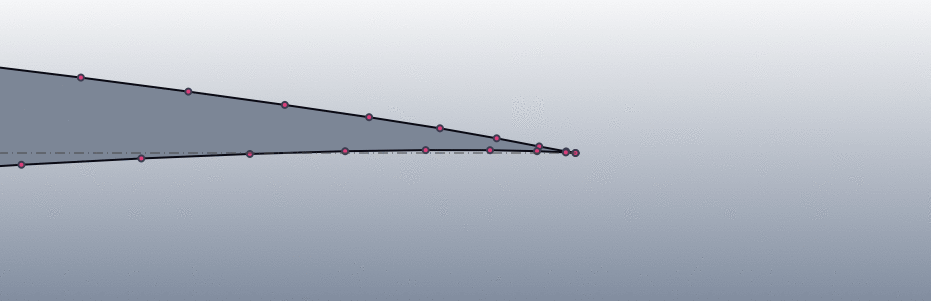
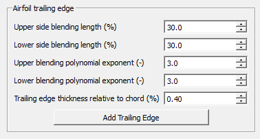
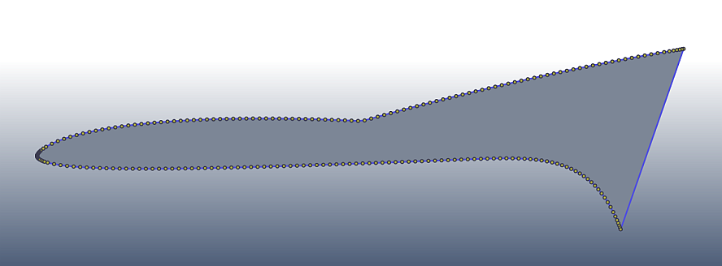

.. _trailing_edge:

Trailing Edge
=============

Adding a finite-thickness trailing edge is optional. If you want a sharp trailing edge, skip this step and continue directly to :ref:`meshing`.

Why Add a Finite-Thickness Trailing Edge?
=========================================

Many real airfoils are manufactured with a non-zero trailing-edge thickness. In other cases, a blunt trailing edge is introduced intentionally because it produces a mesh that is easier to control and inspect around the downstream shear-layer region.

PyAero can add this finite-thickness trailing edge directly to the prepared contour.

   Comparison of a sharp and a finite-thickness trailing edge.

Controls
========

The trailing-edge page in :guilabel:`Geometry Prep` provides:

- :guilabel:`TE thickness (% chord)`
- :guilabel:`Upper blend (% chord)`
- :guilabel:`Lower blend (% chord)`
- :guilabel:`Upper blend exponent`
- :guilabel:`Lower blend exponent`

   Trailing-edge controls in the workflow page.

How the Blend Works
===================

The finite-thickness trailing edge is blended back into the prepared contour over user-defined distances on the upper and lower surfaces. The blend exponent controls how aggressively the contour transitions back to the original shape.

This allows:

- symmetric blends for symmetric sections
- asymmetric blends for strongly cambered airfoils
- short, local transitions or long, gentle reshaping

   Exaggerated blending example showing different upper and lower settings.

Working Tips
============

- Start with a small trailing-edge thickness.
- Keep the blend lengths moderate unless you intentionally want a very long transition.
- If the result feels overworked, rerun :guilabel:`Prepare and Refine` to rebuild the prepared contour and start the trailing-edge step again.

Mesh Implications
=================

A finite-thickness trailing edge activates the dedicated trailing-edge block in a more visible way. The number of vertical subdivisions at the trailing edge and the downstream block spacing now matter for resolving that small opening cleanly.

For this reason, it usually makes sense to review the trailing-edge block settings in :ref:`meshing` after changing the trailing-edge geometry.
