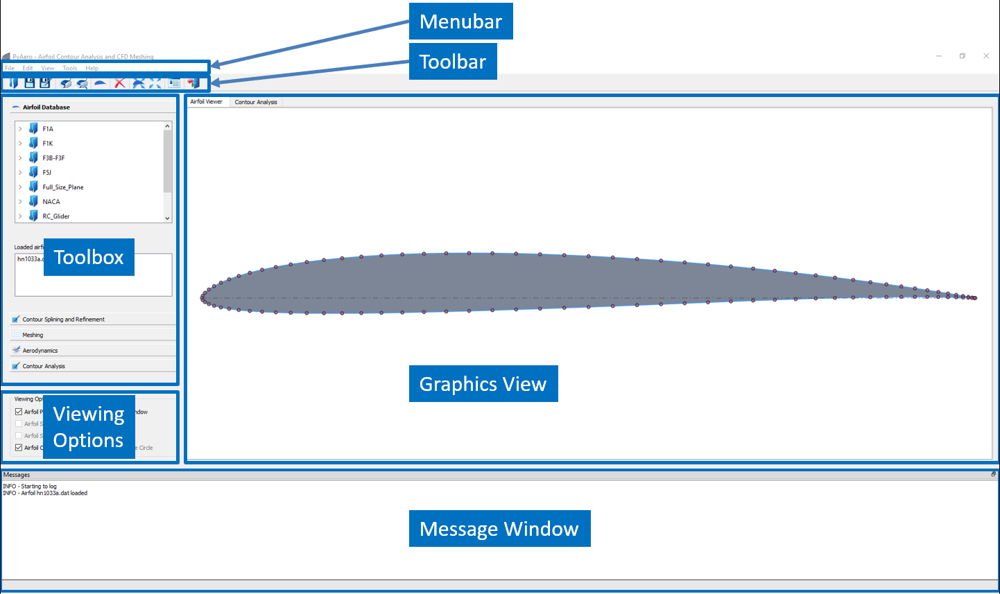
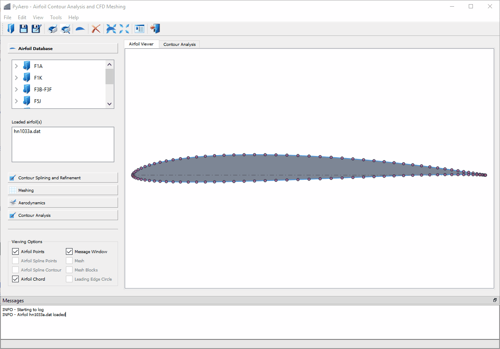
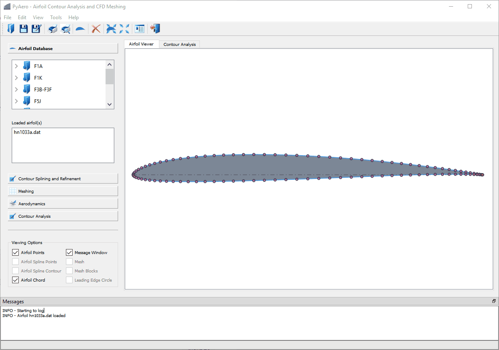

.. make a label for this file
.. _user_interface:

User Interface
==============

`PyAero <index.html>`_ comes with a graphical user interface (GUI) written in `Python <http://www.python.org/>`_ and `Qt for Python (Pyside2) <https://www.qt.io/qt-for-python>`_.

Main Screen
-----------

.. _figure_main_screen_new:

   Graphical user interface of PyAero

Menus
-----

Menus in `PyAero <index.html>`_ try to behave much the same as in typical desktop software. For standard menus as :guilabel:`File` or :guilabel:`Print` the documentation will be kept short. See above figure (:ref:`figure_main_screen_new`) for the location of the menubar in the GUI and below :ref:`figure_menu_structure` for an overview of the menu structure.

The menus in the menubar and the tools in the toolbar (see Toolbar) are coded in a dynamic way. That is, all menus and toolbar items (and their respective handlers/callbacks) are read from XML files (see ``PMenu.xml``, ``PToolbar.xml`` in the ``data/Menus`` folder of the installation). The graphical user interface is automatically populated using the entries of those files. With this structure in place, menus and toolbar items can easily be extended and customized. When adding new menus and thus functionality, it is required to provide corresponding handlers (in *Qt for Python* nomenclature so-called “slots”) to take care of the newly introduced functionality.

.. note::
   The undo/redo framewok is not implemented yet.

.. _figure_menu_structure:
.. figure::  images/menu_structure.png
   :align:   center
   :target:  _images/menu_structure.png
   :name: menu_structure

   PyAero menu structure

.. include:: ui_menu_file.inc
.. include:: ui_menu_edit.inc
.. include:: ui_menu_view.inc
.. include:: ui_menu_tools.inc
.. include:: ui_menu_help.inc

Toolbar
-------

The toolbar in `PyAero <index.html>`_ (see also :ref:`figure_main_screen`) allows fast access to actions which are otherwise triggered by menus. Each of the toolbar buttons launch a specific action. The toolbar can be customized by editing the file :file:`$PYAEROPATH/data/PToolBar.xml`.

.. figure::  images/toolbar_animated.gif
   :align:   center
   :target:  _images/toolbar_animated.gif
   :name: toolbar_animated

   Overview on toolbar options

Toolbox Functions
-----------------

The toolbox functions are arranged at the left border of the GUI (see also :ref:`figure_main_screen`) The toolbox is the main working area when generating meshes with `PyAero <index.html>`_. The complete functionality like splining, refining, contour analysis and meshing are operated there. See the animation below to get an overview on the options available in the toolbox.

.. _toolbox_functions:
.. figure::  images/toolbox_animated.gif
   :align:   center
   :target:  _images/toolbox_animated.gif
   :name: toolbox_animated

   Overview on toolbox options

Tabbed Views
------------

The graphics view in `PyAero <index.html>`_ and a set of other views (see figure below) are arranged via a tab bar, e.g. for using tabbed views.

.. figure::  images/tabbed_views_animated.gif
   :align:   center
   :target:  _images/tabbed_views_animated.gif
   :name: tabbed_views_animated

   Overview on tabbed views

.. note::
   Currently there is only the *Airfoil* tab active, i.e. populated with content when working with PyAero.

Zooming, Panning
----------------

When an airfoil is loaded it is displayed with a size fitted into the graphics view leaving a small margin left and right. The contour can then be panned and zoomed in the following way:

Panning
^^^^^^^

In order to pan (drag) the contour or any other item press and hold :kbd:`CTRL` and then press and hold the left mouse button and move the mouse in order to drag the contour.

   Drag the items in the view by pressing :kbd:`CTRL` and moving the mouse (left button pressed)

Zooming
^^^^^^^

Zooming is activated by pressing and holding the left mouse button. While dragging the mouse a rubberband rectangle is drawn. This rectangle indicates the area which will be zoomed into when releasing the left mouse button. In order to avoid accidential zooming, a minimum size rectangle has to show up. A valid zoom rectangle is indicated by changing its background to a transparent blueish color.

To escape infinite zoom (in and out) limits (MINZOOM, MAXZOOM) are set in the file ``Settings.py``.

   Zoom the items in the view. Set by a rectangle with the left mouse button.
