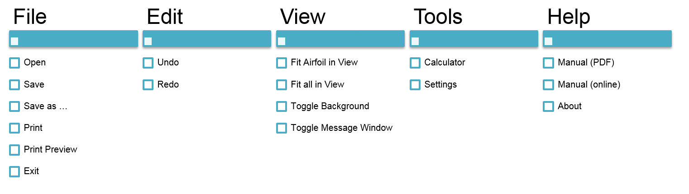
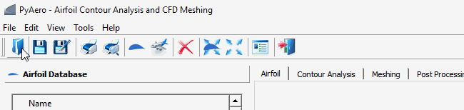
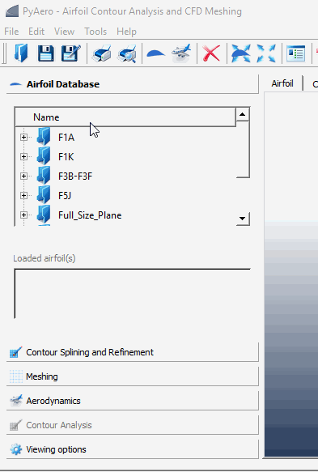
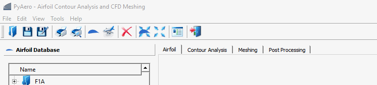

.. make a label for this file
.. _user_interface:

User Interface
==============

`PyAero <index.html>`_ comes with a graphical user interface (GUI) written in PYTHON and `Qt for Python (Pyside2) <https://www.qt.io/qt-for-python>`_.

Main Screen
-----------

.. _figure_main_screen_new:
.. figure::  images/main_screen_new.png
   :align:   center
   :target:  _images/main_screen_new.png
   :name: main_screen_new

   Graphical user interface of PyAero

Menus
------

Menus in `PyAero <index.html>`_ try to behave much the same as in typical desktop software. For standard menus as :menuselection:`File` or :menuselection:`Print` the documentation will be kept short. See `GUI screenshot <mainscreen_>`_ for the location of the menubar in the GUI and `menu structure <menu_structure_>`_ for an overview of the menu structure.

The menus in the menubar and the tools in the toolbar (see Toolbar) are coded in a dynamic way. That is, all menus and toolbar items (and their respective handlers/callbacks) are read from XML files (PMenu.xml, PToolbar.xml).The graphical user interface is automatically populated using the entries of those files. With this structure in place, menus and toolbar items can easily be extended and customized. When adding new menus and thus functionality, it is required to provide respective handlers (referring to Qt for Python nomenclature so-called “slots”) to take care of the newly introduced functionality.

   PyAero menu structure

.. include:: ui_menu_file.inc
.. include:: ui_menu_edit.inc
.. include:: ui_menu_view.inc
.. include:: ui_menu_tools.inc
.. include:: ui_menu_help.inc

Toolbar
-------

The toolbar in `PyAero <index.html>`_ (see also :ref:`figure_main_screen`) allows fast access to actions which are otherwise triggered by menus. Each of the toolbar buttons launch a specific action. The toolbar can be customized by editing the file :file:`$PYAEROPATH/data/PToolBar.xml`.

   Overview on toolbar options

Toolbox Functions
-----------------

The toolbox functions are arranged at the left border of the GUI (see also :ref:`figure_main_screen`) The toolbox is the main working area when generating meshes with `PyAero <index.html>`_. The complete functionality like splining, refining, contour analysis and meshing are operated there. See the animation below to get an overview on the options available in the toolbox.

   Overview on toolbox options

Tabbed Views
------------

The graphics view in `PyAero <index.html>`_ and a set of other views (see figure below) are arranged via a tab bar, e.g. for using tabbed views.

   Overview on tabbed views

.. note::
   Currently there is only the *Airfoil* tab active, i.e. populated with content when working with PyAero.
