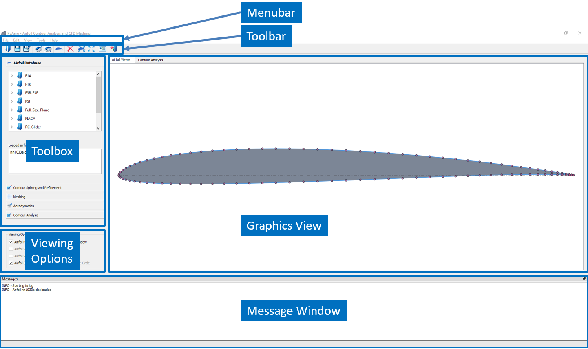
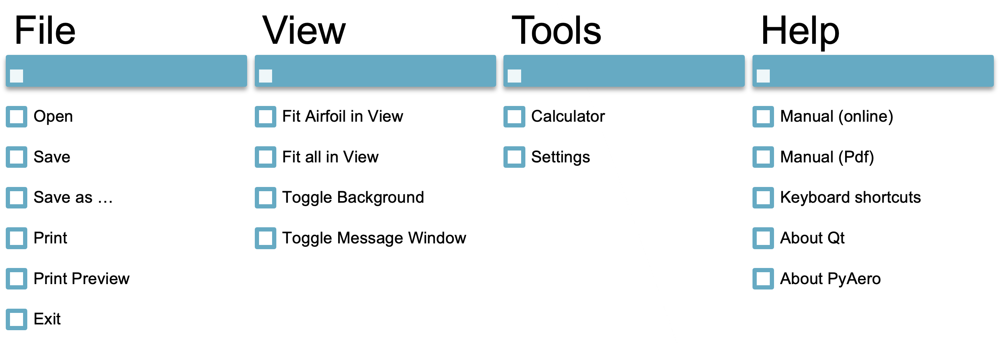
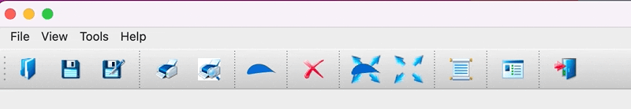
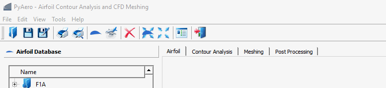
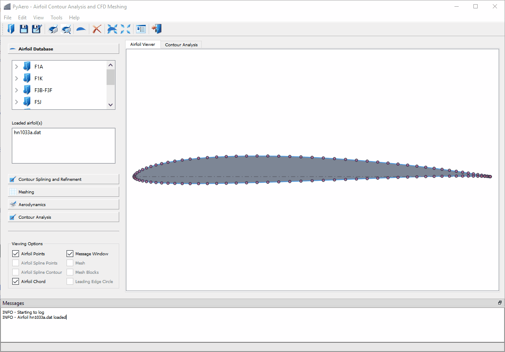
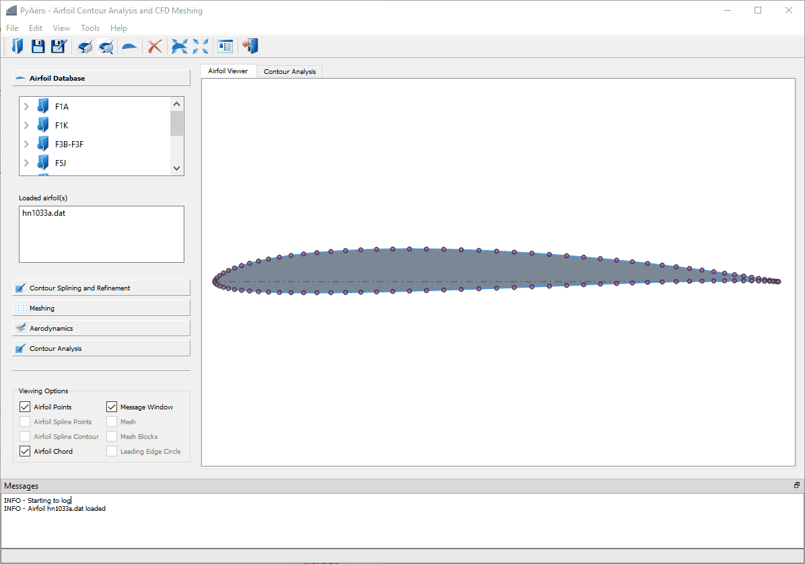

.. make a label for this file
.. _user_interface:

User Interface
==============

`PyAero <index.html>`_ comes with a graphical user interface (GUI) written in `Qt for Python <https://www.qt.io/qt-for-python>`_ aka Pyside6.

Overview
-----------

The layout of the user interface can be seen in the figure below.
Different functional areas are bordered with blue lines. These areas are:

  - Menubar
  - Toolbar
  - Toolbox
  - Graphics view
  - Viewing options
  - Message window

Loading and saving geometry and meshes is done via the menus and the toolbar.
Most operations during geometry preparation and meshing are done inside the toolbox.

.. _figure_main_screen:

   Graphical user interface of PyAero

Menus
-----

Menus in `PyAero <index.html>`_ try to behave much the same as in typical desktop software. For standard menus as :guilabel:`File` or :guilabel:`Print` the documentation will be kept short.
See figure above for the location of the menubar in the GUI and the figure below for an overview of the menu structure.

The menus in the menubar and the tools in the toolbar (see Toolbar) are populated dynamically. Their layout is read from the JSON files :file:`resources/Menus/menu_layout.json` and :file:`resources/Menus/toolbar_layout.json`. Actions, callbacks, icons and built-in keyboard shortcuts are defined centrally in :file:`src/ActionRegistry.py`.

With this structure in place, menus and toolbar items can be extended without duplicating shortcut or handler definitions. Adding a new command usually means defining a new action in the registry and placing its action id in the menu or toolbar layout.

.. _figure_menu_structure:

   PyAero menu structure

.. include:: ui_menu_file.inc
.. include:: ui_menu_view.inc
.. include:: ui_menu_tools.inc
.. include:: ui_menu_help.inc

Toolbar
-------

The toolbar in `PyAero <index.html>`_ allows fast access to actions which are otherwise triggered by menus. Each toolbar button launches a specific shared action. The toolbar layout can be customized by editing :file:`resources/Menus/toolbar_layout.json`.

   Overview on toolbar options

Toolbox Functions
-----------------

The toolbox functions are arranged at the left border of the GUI. A *toolbox* is a GUI element that displays a column of tabs one above the other, with the current item displayed below the current tab. The toolbox is the main working area when generating meshes with `PyAero <index.html>`_. The complete functionality like splining, refining, contour analysis and meshing are operated there. See the animation below to get an overview on the options available in the toolbox.

.. _toolbox_functions:
.. figure::  images/toolbox_animated_NEW.gif
   :align:   center
   :scale: 60%
   :target:  _images/toolbox_animated_NEW.gif
   :name: toolbox_animated

   Overview on toolbox options

Tabbed Views
------------

The graphics view in `PyAero <index.html>`_ and a set of other views (see figure below) are arranged via a tab bar. E.g., the views can be switched between the graphics view and the contour analysis view. The latter contains graphs for curvature analysis.

   Overview on tabbed views

.. note::
   The look and feel of the tabs might change over time.

Zooming, Panning
----------------

When an airfoil is loaded it is displayed with a size that fits into the graphics view (leaving a small margin left and right). The contour can then be panned and zoomed in the following way:

Panning
^^^^^^^

In order to pan (drag) the contour or any other item press and hold :kbd:`CTRL` (:kbd:`CMD` on MacOS) and then press and hold the left mouse button and move the mouse in order to drag the contour.

   Drag the items in the view by pressing :kbd:`CTRL` and moving the mouse (left button pressed)

Zooming
^^^^^^^

Zooming is activated by pressing and holding the left mouse button. While dragging the mouse, a rubberband rectangle is drawn. This rectangle indicates the area which will be zoomed when releasing the left mouse button. In order to avoid accidential zooming too deep, a minimum size rectangle has to show up. A valid zoom rectangle is indicated by changing its background to a transparent blueish color. The minimum allowed size can be configured in :file:`config/config.ini` via the :code:`RUBBERBAND_MIN` entry in the :code:`[Graphics]` section. In order to zoom in deeper, the rubberband rectangle can be subsequently used.

Zoom limits (:code:`MIN_ZOOM`, :code:`MAX_ZOOM`) are set in :file:`config/config.ini` in the :code:`[Graphics]` section.

   Zoom the items in the view. Select a rectangle using the left mouse button.

Another natural possibility to zoom the view, is to use the scroll wheel. Thereby the geometry is zoomed with respect to the current mouse position. 

Zooming can further be done using the :kbd:`Page-Up` and :kbd:`Page-Up` down keys.

A reset to the initial (home) position can either be achieved by pressing the :kbd:`HOME` key or by right clicking in the graphics view and selecting :guilabel:`Fit airfoil in view` from the pulldown menu.

Keyboard shortcuts
------------------

To speed up some operations, a set of keyboard shortcuts is defined centrally in :file:`src/ActionRegistry.py`. Menus show the currently assigned shortcuts next to the corresponding actions, and the shortcut overview dialog is generated from the same registry. By default, :kbd:`CTRL+k` on Windows and Linux and :kbd:`CMD+k` on MacOS open the overview of available keyboard shortcuts. User-specific shortcut overrides can be stored in :file:`config/shortcuts.json`.

.. note::
   Keyboard shortcuts are rendered by Qt using platform conventions.
   Depending on the operating system, modifiers and letters can therefore appear with slightly different capitalization or symbols.
