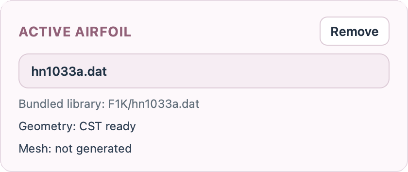
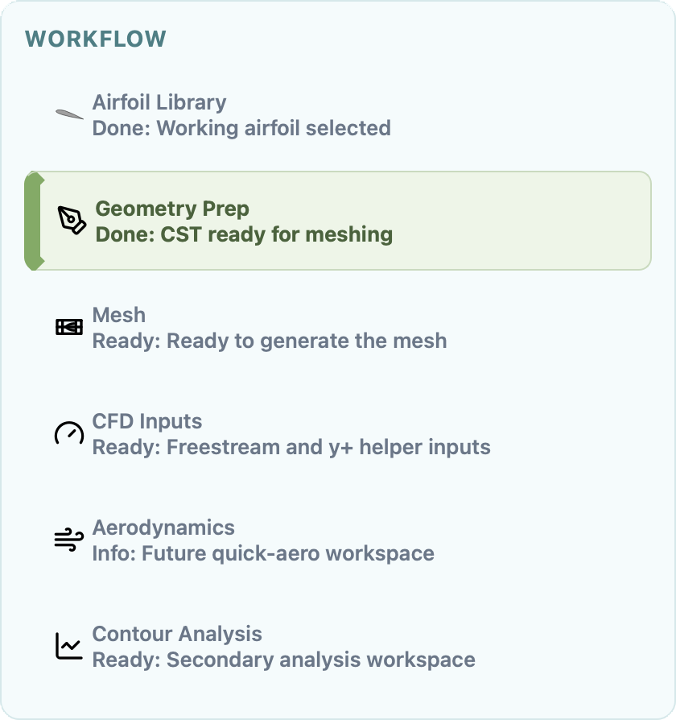
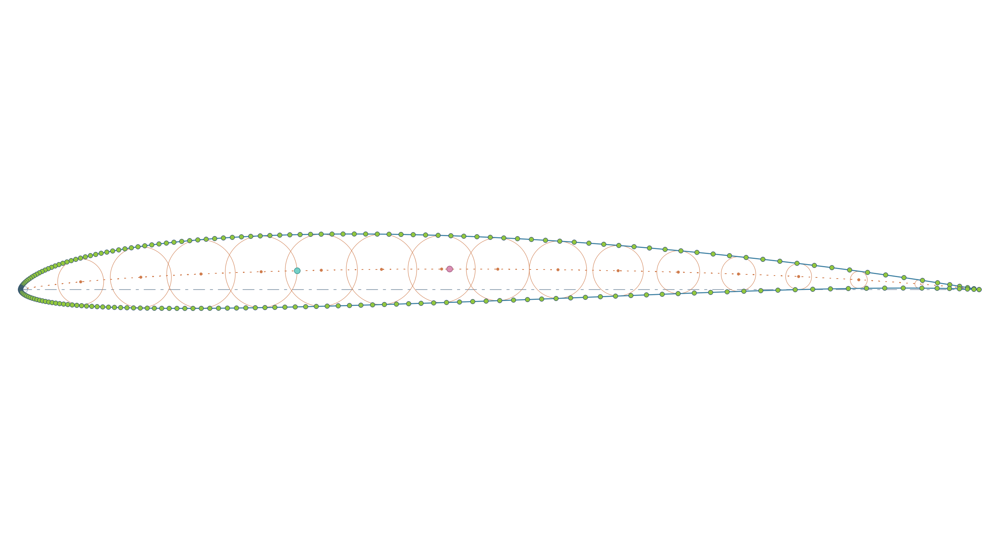
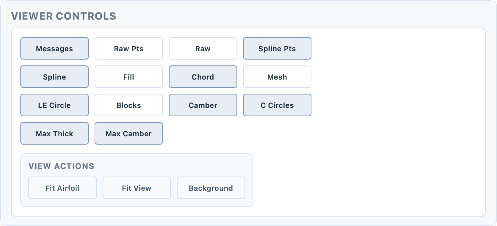
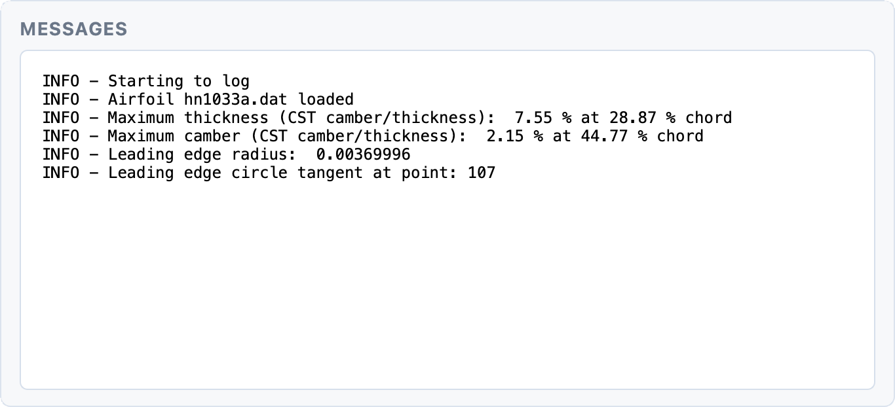
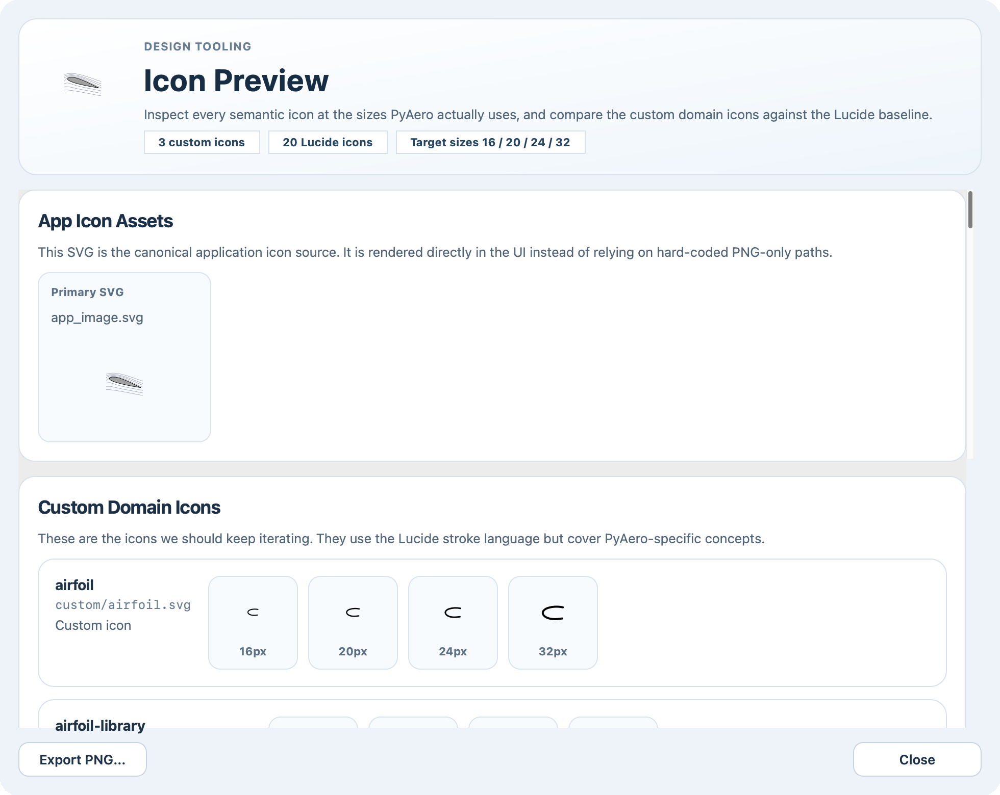
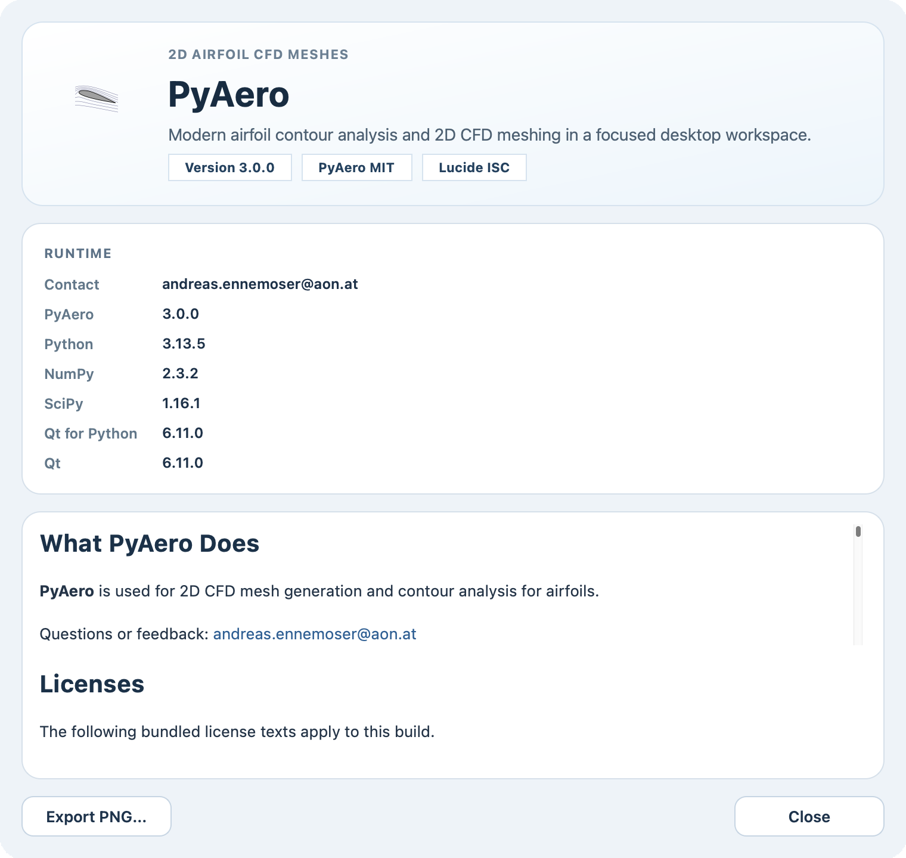

.. _user_interface:

User Interface
==============

PyAero uses a workflow-oriented desktop interface built with `Qt for Python <https://www.qt.io/qt-for-python>`_. The current layout is designed to keep the main meshing path visible at all times while still exposing the analysis and helper tools around it.

Overview
========

The window is organized into two main areas:

- a workflow sidebar on the left
- a workspace on the right

The workflow sidebar contains the active airfoil summary, the page navigation, and the currently selected tool page. The workspace contains the geometry view, the contour analysis tab, the message panel, and the viewer controls.

.. figure:: images/ui_overview_main.png
   :align: center
   :width: 85%
   :target: _images/ui_overview_main.png

   PyAero main window with the workflow shell.

Workflow Pages
==============

The left-hand workflow sidebar is split into dedicated pages:

- :guilabel:`Airfoil Library`
- :guilabel:`Geometry Prep`
- :guilabel:`Mesh`
- :guilabel:`CFD Inputs`
- :guilabel:`Aerodynamics`
- :guilabel:`Contour Analysis`

The active airfoil summary at the top of the sidebar shows:

- the loaded airfoil name
- where it came from
- whether prepared geometry is available
- whether a mesh has already been generated

   Active airfoil summary card at the top of the workflow sidebar.

   Workflow navigation card for switching between the main tool pages.

Menus and Toolbar
=================

Menus and toolbar buttons are registry-driven. Actions, tooltips, shortcuts, and icons are defined centrally, while the menu and toolbar layouts are assembled from bundled configuration data.

This keeps the interface consistent:

- menus and toolbar buttons trigger the same action definitions
- the shortcut editor works against the same registry
- adding a new action does not require duplicating logic in several places

.. figure:: images/menu_structure_NEW.png
   :align: center
   :width: 80%
   :target: _images/menu_structure_NEW.png

   Menu structure overview.

The :guilabel:`View` menu also contains a :guilabel:`Window Size` submenu for cycling or applying three configured screenshot-friendly window presets. For docs work, :guilabel:`Tools > Export UI` now groups direct PNG exports for the rounded sidebar cards, the utility panels, and the current canvas, and it also offers a one-shot complete export into a folder. Major dialogs also expose their own :guilabel:`Export PNG...` button so they can be captured cleanly without manual cropping. The canvas screenshot action ships with the default shortcut ``Ctrl+Alt+S``.

.. figure:: images/toolbar_animated_NEW.gif
   :align: center
   :scale: 70%
   :target: _images/toolbar_animated_NEW.gif

   Toolbar overview.

Tool Pages
==========

Most day-to-day work happens inside the workflow pages rather than through modal dialogs. In practice this means:

- airfoil selection happens in the library page
- contour preparation happens in the geometry page
- mesh creation and export happen in the mesh page
- CFD helper calculations happen in dedicated side pages

.. figure:: images/toolbox_animated_NEW.gif
   :align: center
   :scale: 60%
   :target: _images/toolbox_animated_NEW.gif

   Overview of the page-based workflow controls.

Workspace Tabs
==============

The right-hand workspace contains:

- the main graphics viewer
- the contour analysis view

The graphics viewer is the main place for loading, inspecting, and reviewing the contour and generated mesh. The contour analysis tab shows the derived plots for gradient, curvature, and radius.

.. figure:: images/tabbed_views_animated.gif
   :align: center
   :target: _images/tabbed_views_animated.gif

   Switching between the graphics and analysis views.

   Main graphics viewer canvas used for contour and mesh inspection.

Workspace Panels
================

Two utility panels sit close to the main canvas so the workflow stays visible while you work:

- the viewer controls panel
- the message panel

The viewer controls panel groups fit actions, background switching, message visibility, and quick access to magnifier-related tools. The message panel shows load status, export summaries, warnings, and other workflow feedback without forcing a modal dialog.

   Viewer controls for fit commands, background toggle, message visibility, and magnifier access.

   Integrated message panel for status, warnings, and export feedback.

Navigation
==========

Panning
-------

Press and hold :kbd:`CTRL` on Windows or Linux, or :kbd:`CMD` on macOS, then drag with the left mouse button to pan the scene.

.. figure:: images/drag_view.gif
   :align: center
   :target: _images/drag_view.gif

   Panning the scene.

Zooming
-------

You can zoom in three ways:

- draw a rubber-band rectangle with the left mouse button
- use the mouse wheel
- use the keyboard shortcuts for zooming

.. figure:: images/zoom_view.gif
   :align: center
   :target: _images/zoom_view.gif

   Rubber-band zoom in the graphics view.

Magnifier
---------

The graphics viewer also includes a hover magnifier for close inspection without changing the main zoom level. You can enable it from :menuselection:`View --> Toggle magnifier`, from the graphics-view context menu, or with the default shortcut ``Ctrl+Alt+M``.

While the magnifier is active:

- moving the pointer repositions the lens
- the mouse wheel changes the lens magnification
- ``+`` and ``-`` adjust magnifier zoom from the keyboard
- ``Ctrl++`` and ``Ctrl+-`` increase or decrease the lens size
- the regular fit, zoom, background, and delete actions are temporarily disabled so the lens interaction stays focused

The default lens size and magnification are configurable through :ref:`tutorial_settings`.

Keyboard Shortcuts
==================

Keyboard shortcuts are managed centrally. Built-in defaults live in :file:`resources/Shortcuts/shortcuts.json`, and user overrides are stored in :file:`config/shortcuts_user.json`.

The shortcut editor is available from the help menu and by default opens with:

- :kbd:`Ctrl+K` on Windows and Linux
- :kbd:`Cmd+K` on macOS when mapped through Qt's platform conventions

The editor allows you to:

- inspect the current shortcut map
- compare built-in and overridden bindings
- save one platform-specific override per action

The actual text rendered by Qt may vary slightly across operating systems.

Support Dialogs
===============

Several utility dialogs support the main workflow and the surrounding UI maintenance tasks:

- :guilabel:`Settings` opens the editable runtime configuration
- :guilabel:`Icon Preview` shows semantic icons and bundled app assets
- :guilabel:`About PyAero` summarizes version, license, and environment details

   Icon preview dialog for checking semantic icons and bundled assets.

   About dialog with project, license, and environment information.
